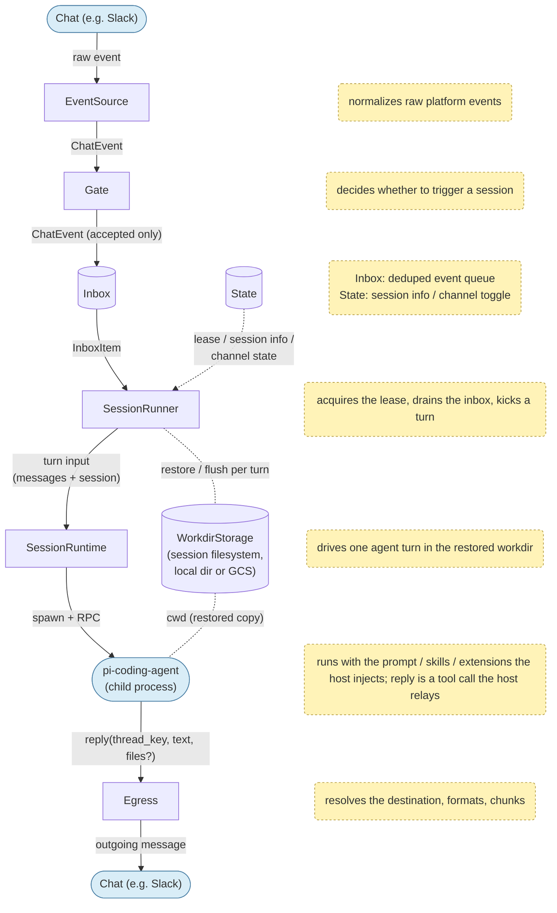

# pi-chat-runner

A low-cost, serverless runner for running the [pi](https://github.com/earendil-works/pi) coding agent from chat.

See [docs/design/README.md](docs/design/README.md) for the design.

## Overview

- The session boundary is a `thread_key`, a conversation scope determined by config
- The agent replies only through the `reply` tool; the host owns the actual destination
- Per-channel trigger conditions, prompts, and models are declared in YAML — a message mention, keyword, or LLM classifier, or an emoji reaction on an existing message, can kick a session. Posts from other bots (e.g. alerting webhooks) can trigger too via per-channel opt-in (`trigger.allowBots`); the bot's own posts never do
- Chat commands (`/new`, `/enable`, `/disable`) reset or mute a channel from within the chat — see [Chat Commands](#chat-commands)
- DB (inbox / session / lease / channel-state) and workdir archival are independent, swappable backends

## Components

One pipeline, top to bottom. Boxes are components, cylinders are persistent stores, and blue rounded nodes are the outside world (the chat platform, the pi child process); edge labels name the data handed between stages, and notes describe each component's job.



Each stage only knows the interface of its neighbor, not which implementation is behind it. `SessionRunner` restores the workdir via `WorkdirStorage` before a turn; new vs. resume follows from whether a transcript exists after restore. `StateStore` feeds `SessionRunner`'s decisions — whether to run at all (channel mute), which instance runs (lease), and which session a message joins (session info, affinity pointer); the outcome travels down the pipeline as the session part of the turn input.

A real deployment (your own Slack App, your own Cloud Run service) lives in a separate repo that extends the base image with `FROM` and fills in the `examples/` templates with real values — see [docs/design/session-runtime.md](docs/design/session-runtime.md) §5.

## Usage Patterns

There are three ways to use this project, from least to most integration effort.

### 1. Run the published container image as-is

Deploy the base image directly — published to `ghcr.io/pokutuna/pi-chat-runner` on each tagged release (see `.github/workflows/docker-publish.yaml`) — e.g. to Cloud Run (see `examples/service.yaml`), and only supply config: a single `agent.yaml` (connector/store/agent runtime + per-channel triggers/prompts/models), plus a Slack App from one of the `examples/slack-app-manifest.*.yaml` templates. No image build required.

This gets you mention/keyword/classifier/reaction triggers, threaded replies, and persistence — but only the CLI tools baked into the base image (`git`/`curl`/`jq`/`ripgrep`/`fd`) and whatever skills/extensions ship in the image's agent home (`$AGENT_HOME/.pi/agent/{skills,extensions}` — empty in the base image beyond the built-in reply/permission-gate/export extensions, which are always injected).

You can go a bit further without rebuilding, by bind-mounting extra files onto the running container instead of baking them into the image — pi discovers skills and extensions by directory, not by build-time manifest:

```sh
docker run \
  -v ./my-config:/app/examples/config:ro \
  -v ./my-skills:/home/agent/.pi/agent/skills:ro \
  -v ./my-extensions:/home/agent/.pi/agent/extensions:ro \
  ghcr.io/pokutuna/pi-chat-runner:latest
```

This works for skills/extensions and config, but not for installing additional CLI tools (`apt-get`, etc.) — that needs pattern 2.

### 2. Customize the image

Extend the base image with your own Dockerfile — add CLI tools the agent's `bash` tool can call, or ship skills/extensions baked in rather than mounted. See [`examples/gc-logging-agent/`](examples/gc-logging-agent) for a complete example (adds `gcloud`/`duckdb`/`uv` and a log-investigation skill).

```dockerfile
ARG BASE_IMAGE=pi-chat-runner:local
FROM ${BASE_IMAGE}

# Add a CLI tool the agent can call via bash
RUN apt-get update && apt-get install -y --no-install-recommends duckdb \
  && rm -rf /var/lib/apt/lists/*

# Skills: pi's default discovery path is $AGENT_HOME/.pi/agent/skills/
COPY --chown=1001:1001 skills/ /home/agent/.pi/agent/skills/

# Extensions: any .ts/.js directly under $AGENT_HOME/.pi/agent/extensions/
# is passed to pi's --extension automatically (in addition to the runner's
# own reply/permission-gate/export extensions, which are always injected)
COPY --chown=1001:1001 extensions/ /home/agent/.pi/agent/extensions/

# Per-channel skills/extensions: bake them OUTSIDE the auto-discovery paths
# and reference them from agent.yaml (channels[].skills / .extensions):
#   - channel: "C0000000001"
#     skills: [/app/skills/gc-logging]
COPY --chown=1001:1001 channel-skills/ /app/skills/
```

Runtime user is uid/gid `1001` (`agent`) when UID separation is enabled (`PI_AGENT_UID`/`PI_AGENT_GID`), so `--chown=1001:1001` keeps files writable/readable by the process that actually runs pi.

### 3. Embed just the runner (no bundled Slack server)

If you already have a Slack bot (or any other event source) and just want to kick a pi session from it — without running this project's HTTP/Socket-Mode server — import `SessionRunner` directly and call `handle()`/`handleReaction()` from your own event handler:

```ts
import {
  SessionRunner,
  FileConfigSource,
  InMemoryStateStore,
  EgressRouter,
  Reactions,
  SlackIngressAdapter, // reuse Slack raw-event → InboundMessage normalization if useful
  toMrkdwn,
} from "pi-chat-runner";

const runner = new SessionRunner({
  configSource: new FileConfigSource("./config/agent.yaml"),
  store: new InMemoryStateStore(), // or a SQLite/Firestore-backed StateStore
  router: new EgressRouter({ poster: myPoster, formatter: toMrkdwn }),
  reactions: new Reactions(myReactionClient),
  workdirStorage: myWorkdirStorage,
  mentionFormat: (userId) => `<@${userId}>`, // your platform's mention syntax
});

// Inside your own bot's message handler:
await runner.handle(inboundMessage);
```

`SessionRunner` owns gating, inbox/lease/dedupe, spawning pi, and steering — everything below the event source. The built-in extensions (`reply`/`permission-gate`/`export`) are resolved and injected by `SessionRunner` itself. You only need to normalize your incoming event into an `InboundMessage` (or reuse `SlackIngressAdapter` if the source is Slack) and supply a `ChatPoster` for replies. See `src/index.ts` for the full list of exported building blocks.

Not published to npm yet (planned). Until then, clone this repo, run `pnpm install && pnpm build`, and reference it as a `file:` / workspace dependency — a bare git dependency won't work because `dist/` is built, not committed.

## Chat Commands

Text commands, sent as a chat message, control a channel without touching config:

- `/new` — cut the session: the next trigger starts with clean context. `/new <text>` kicks a new session with that text immediately. Rejected while a session is running.
- `/enable` / `/disable` — per-channel kill switch (default enabled). While disabled, all triggers are silently dropped; `/enable` recovers. State persists in the channel-state store.

Commands are exact-match (except `/new <text>`), human-senders only, and normally apply to messages that pass the Gate — in a mention-gated channel send `@bot /new` (which also keeps Slack's client from capturing a bare leading `/` as its own slash command).

## Configuration

One YAML file, pointed at by `CONFIG_PATH` (default `examples/config/agent.yaml`; the filename is up to you):

- **`connector` / `store` / `agent` sections** — bridge-wide, read once at boot: Slack connector (mode/tokens), store backend, agent turn timeout and runtime (UID separation, env passthrough to the pi child process). These sections support `${env.X}` / `${env.X:-default}` references to pull values from the process environment (secrets included).
- **`channels` section** — per-channel behavior, re-read on every message (no restart needed): trigger gates, `systemPrompt`, `model` (pi's `provider/model-id[:thinking-level]` shorthand; the provider prefix is required), `tools`/`excludeTools`, session mode, and per-channel `skills`/`extensions` (paths to image-baked skills/extensions, loaded in addition to the common ones under `$AGENT_HOME/.pi/agent/`). An array listing all channels, with a required `default` entry as the fallback. `systemPrompt`/`context` values starting with `./` are read as files relative to the config file's directory; relative `skills`/`extensions` paths resolve from there too.

A `channels` section excerpt:

```yaml
channels:
  - channel: "default"       # fallback for channels with no matching entry
    model: google-vertex/gemini-3.5-flash
    systemPrompt: ./prompts/ask-ai.md
    trigger:
      when:
        - kind: mention

  - channel: "C0000000001"
    systemPrompt: ./prompts/ask-ai.md
    trigger:
      # when is a boolean tree of gates: a bare array is OR, {and}/{or} compose explicitly.
      when:
        - kind: mention
        - kind: reaction   # an emoji reaction on an existing message kicks a session on that message
          emoji: [eyes, robot_face]

  - channel: "dm"
    # DMs are not covered by "default", and are disabled by default (no mention-like
    # gate makes sense in a 1:1 DM). This "dm" entry is only needed to opt DMs in —
    # e.g. `when: [{kind: passthrough}]` to accept every DM. Omitting it (or leaving
    # `when: []` as shown) keeps DMs disabled; the same pattern on "default" blocks
    # any channel with no explicit entry.
    trigger:
      when: []

  - channel: "C0000000002"
    # Humans trigger by mention; bot posts (e.g. alert webhooks, allowBots opt-in) by keyword only
    trigger:
      allowBots: true
      when:
        - and: [{ kind: sender, is: human }, { kind: mention }]
        - and: [{ kind: sender, is: bot }, { kind: keyword, pattern: "ALERT|CRITICAL" }]
```

DB defaults to in-memory (`store.backend: memory` in `agent.yaml`); set it to `sqlite` (default path `/tmp/pi-chat-runner/state.db`) or `firestore` for persistence. Workdir archival defaults to no-op unless the `WORKDIR_ARCHIVE_DIR` env var is set. See [docs/design/persistence.md](docs/design/persistence.md).

See [`examples/config/agent.yaml`](examples/config/agent.yaml) for an annotated template. Full schema and semantics: [docs/design/config.md](docs/design/config.md).

To see what a channel's merged (default/dm + channel entry) config actually resolves to, run `node dist/server.mjs dump <channelId> [--json]` — it prints each field with its provenance, without starting the bot.

## Local Development

```sh
pnpm install
pnpm run dev:local    # REPL against the real pipeline, no Slack needed — start here
pnpm run dev:socket   # real Slack, Socket Mode
pnpm run dev          # real Slack, Events API
```

### Without Slack: `dev:local`

`dev:local` runs the whole pipeline — gate → inbox → session (real pi) → egress — against a terminal UI ([ink](https://github.com/vadimdemedes/ink)) split top/bottom into a log pane (structured pino logs; pi-agent events are tagged `[pi]`, runner components `[session]` etc.) and a chat pane (conversation + input), keeping the two readable instead of interleaving on one stdout. Each pane tails its latest output; arrow keys / PageUp-Down scroll the focused pane (Tab cycles focus, the focused pane is marked `*`), C-p / C-n recall input history, and the mouse wheel scrolls the pane under the cursor. No Slack App or tokens required; put only the model credentials (e.g. `GOOGLE_CLOUD_PROJECT`) in `.env.local`. Config is read from `CONFIG_PATH` as usual: the `connector` section is ignored, and `channels`/`store`/`agent` apply as-is, so passing a real channel ID (`node dist/server.mjs local C0123456789`) exercises that channel's production config. The default channel ID is `local` — the example `agent.yaml` ships a matching entry.

Chat pane interaction (log pane omitted for brevity):

```
#local you> @bot investigate this alert
[1] you: @bot investigate this alert
[2]↳1 bot:
   Looking into it ...
#local you> >1 any update?     (reply in [1]'s thread — N is the number shown as [N])
#local you> !react 1 eyes      (put an emoji reaction on [1])
#local you> !help              (full grammar: switch channel/user, DM mode, ...)
```

Chat commands (`@bot /new` etc.) flow through as normal message text. Full grammar and design: [docs/design/local-dev.md](docs/design/local-dev.md).

### Against real Slack

Create a Slack App from the `examples/slack-app-manifest.*.yaml` templates and put its credentials in the env file your dev script reads — the variable names are the `${env.*}` references in `examples/config/agent.yaml`. Whether the connector uses Socket Mode or the Events API is Slack-connector config (`connector.slack.mode`), invisible to the rest of the pipeline. What only real Slack can verify — actual mrkdwn rendering, file uploads, rate limits — needs this layer.

### Checks

```sh
pnpm test
pnpm run typecheck
pnpm run lint
```

## Status

Under active development. Currently Slack and Google Cloud (Cloud Run + Firestore + GCS) only — other chat platforms and cloud providers are not supported yet. The initial-version goal has been reached. The CLI (`apply`/`status`/`init`) is deferred — configuration is read directly from YAML via `FileConfigSource`, so `apply` (and a `FirestoreConfigSource`) are not needed for now.
