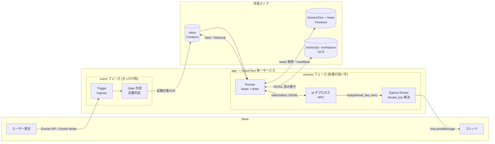

# Piper — Slack-driven pi agent bridge

- Author: pokutuna
- Status: 実装済み (初期版ゴール達成)
- Created: 2026-07-05
- URL: (発行後に記入)

## Objective

Slack のチャンネル/スレッドから pi コーディングエージェントに調査・質問応答を依頼できる常駐ブリッジを、待機コストほぼゼロの Google Cloud 構成で提供する。

## Background

本設計は hermes-agent (NousResearch) と pi (earendil-works) の実装調査 ([Related Documents](#related-documents) 参照) を出発点にしている。pi は RPC モード・JSONL による永続化・extension 機構を備えた強力な実行エンジンだが、チームのチャットから使う常駐窓口を持たない。一方 hermes-agent はチャット駆動エージェントの実装として、セッションモデリング・steering・起動判定の設計の参照元になった。この 2 つの調査から得た設計原則を、単一組織の Slack ワークスペースで運用する具体設計に落とし込んだのが本ドキュメントである。

想定する利用シーンは単一組織における低〜中頻度の利用であり、常駐サーバーの固定費を払い続けることは避けたい。そこで Cloud Run の min-instances=0 (スケールツーゼロ) を軸に、状態は Firestore と GCS に外出しし、モデルは Vertex AI 経由の Gemini を使う構成を前提とした。

調査を通じて確立した設計原則は次の 3 つに要約できる。

- **プロセスと状態の分離**: Cloud Run のインスタンスは使い捨てで、いつ消えてもよい。会話の状態はすべて Firestore / GCS に置き、どのインスタンスが拾っても続きが動く。
- **スレッド = セッション**: Slack のスレッドをそのままセッション境界として扱う。境界が人間に見え、並行実行が自然に成立する。
- **出力は reply tool 経由**: エージェントは地の文でなく `reply` tool を通じてのみユーザーに出力する。宛先の実体はホストが握り、二重投稿や宛先の取り違えを構造的に防ぐ。

## Goals

- Slack のスレッドから調査・質問応答・作業を依頼できるようにする
- 待機コストをほぼゼロに保つ (使った分だけ課金)
- チャンネルごとの振る舞い (起動条件・プロンプト・モデル) を YAML で宣言的に変えられるようにする
- 利用者が能力 (CLI / skill) をイメージ拡張 1 段で追加できるようにする
- 事故 (secret 漏洩・データ覗き見) を構成で防ぐ

## Non-Goals

- マルチワークスペース / マルチテナント対応はしない (単一組織前提)
- 悪意あるプロンプトインジェクションへの完全サンドボックスは初期版では提供しない ([Security](#security) 参照。事故防止と影響半径の最小化にとどめる)
- Slack 以外のチャット面の初期実装はしない (Ingress 抽象で将来の口だけ確保する)
- MCP 接続はしない (pi にネイティブサポートが無い)
- リアルタイムのストリーミング表示はしない (reply 単位の投稿にとどめる)。長時間ターンの粗い進捗通知 (数十秒間隔のスナップショット更新) は別カテゴリとして許容する ([progress-notice.md](progress-notice.md))

## Scenarios

1. **#ask-ai での mention 起動**: ユーザーが `#ask-ai` で bot にメンションする。トリガーメッセージに 👀 リアクションが付き、pi が調査を行う。調査結果は `reply` を通じてスレッドに投稿される (話題が複数あれば複数回投稿されうる)。完了すると 👀 が ✅ に差し替わる。
2. **実行中の追撃**: pi が実行中のスレッドに人間が追いメッセージを投稿する。メッセージは実行中の pi に steering として注入され、次のターン境界で方針が変わる。
3. **keyword チャンネルと DM**: keyword Gate を設定したチャンネルではキーワード一致で自動起動する。DM は既定では起動しない (disabled) — 予約名 `dm` エントリで trigger を明示指定 (例: passthrough) すると有効化できる ([config.md](config.md) §2.1)。

## Diagrams



イベントは Trigger (どう届くか) → Gate (反応するか) → Inbox (取りこぼさない) → Session (誰が処理するか) の順に通る。処理側は Runner が pi を駆動し、出力は Reply だけがユーザーに届く。各コンポーネントの詳細版は [components.md](components.md) にある。

## Interfaces

契約面として表に見える部分だけを要約する。詳細な型定義や実装はリンク先を参照。

| インタフェース | 概要 |
|---|---|
| `reply(thread_key, text)` tool | エージェントの唯一のユーザー向け出力。1 ターン中に複数回呼べる。宛先の実体 (channel / ts) はホストが握り、pi は thread_key を言うだけ ([chat-model.md](chat-model.md)) |
| `channels/*.yaml` | チャンネルの振る舞い定義 (プロンプト・Gate・model)。Gate は登録済み type から選ぶ registry 選択式 ([config.md](config.md)) |
| CLI | `status` (sessions 一覧・transcript dump) / `init` (拡張イメージ・config の scaffold 生成) |
| 拡張 Dockerfile | `FROM <base-image>` に 1 段重ねるだけの拡張。`$AGENT_HOME/.pi/agent/skills/` (skill 配置) 等の pi 既定パス規約に従う ([session-runtime.md](session-runtime.md)) |

`channels/*.yaml` の例 (mention と分類器を OR で束ねる Gate 設定。配列 = OR、`{and}`/`{or}` で明示的に合成する):

```yaml
trigger:
  when:
    - kind: mention
    - kind: classifier
      model: gemini-2.5-flash-lite
      criteria: "..."
```

## Dependencies / Infrastructure

後から変えにくい判断に絞って記す。

- **Google Cloud**: Cloud Run 単一サービス (CPU always-allocated) 上で稼働。Firestore を唯一の DB とし、GCS を FUSE マウントして transcript / workspace / artifacts を保持する。モデルは Vertex AI 経由の Gemini (既定は Flash 系)。
- **Node 26 / TypeScript 最新安定版**。HTTP サーバーは Hono、Slack との接続は `@slack/web-api` + `@slack/socket-mode` を使う (Bolt フレームワークは不採用)。
- **pi は npm パッケージ `@earendil-works/pi-coding-agent` を子プロセスとして spawn する** (コンテナを新規起動するのではなく、同一コンテナ内でプロセスを立てる)。

変えにくい判断はここに集約される: 「単一サービスへの同居 + lease による排他」と「状態は Firestore 一本にまとめる」がアーキテクチャの背骨であり、これを変えることは作り直しに近い。

## Security

初期版の隔離が目指すのは「悪意あるプロンプトインジェクションへの完全なサンドボックス」ではなく、事故と覗き見の防止、および影響半径の最小化である。

#### エージェントが bridge の secret (SLACK_BOT_TOKEN) を読む
Scenario: pi の bash ツールで `env` や `/proc/<pid>/environ` を読み、bridge が保持する Slack bot token を取得する。
Mitigations:
- env allowlist を設け、pi 子プロセスに渡す環境変数を絞る
- UID 分離: pi を別ユーザー (uid 1001) で spawn し、同一 UID でなければ読めない `/proc/<pid>/environ` の性質を利用する
- token 自体を pi プロセスに一切渡さない。reply の実投稿は常にホスト (Runner) 側が行う

#### エージェントが他チャンネル・他セッションのデータを読む
Scenario: GCS FUSE マウントや同一インスタンス上の他セッションの workdir を bash で覗く。
Mitigations:
- GCS FUSE を uid=runner, dir-mode=0700 でマウントし、pi の agent uid からは traverse 不可にする。pi が触れるのは自セッションの workdir へのコピーのみ (restore/flush はホストの仕事)
- workdir をセッションごと 0700 で作成する
- 同一 agent uid 間の読み取りは残余リスクとして明記し、問題化したら per-session uid か concurrency=1 に倒す

#### エージェントがメタデータサーバーから SA トークンを取る
Scenario: `curl metadata.google.internal` で実行 SA のトークンを取得し、Firestore/GCS を直接叩く。
Mitigations:
- コンテナ内ではこの経路を技術的に防げないことを明記した上で受容する
- 実行 SA のロールを最小化 (Vertex AI + 必要最小限の Firestore/GCS) し、影響半径を絞る
- ハード隔離が要る運用になれば、実行専用サービスへの分離や microVM 方式への昇格を将来パスとして用意する ([session-runtime.md](session-runtime.md) §6)

#### エージェントが任意の宛先に投稿する
Scenario: エージェントが偽った thread_key や channel を指定し、意図しない宛先に投稿する。
Mitigations:
- 投稿先の実体 (channel / ts) は常に bot (ホスト) が握り、pi は thread_key を渡すだけ
- thread_key はホストにとって不透明なキーであり、ts ↔ 宛先の変換ロジックを pi 側に持たせない
- reply extension は常時コード注入される固定の仕組みであり、Config (YAML) から外すことはできない

#### エージェントが誤って (あるいは指示された通りに素直に) 事故を起こすコマンドを実行する
Scenario: bash ツールでパッケージのグローバルインストール・`rm -rf /` 相当の破壊的操作・
workdir 外の chmod/chown・`kill -9 1` のような、悪意ではなく事故として起きるコマンドを実行する。
Mitigations:
- `extensions/permission-gate.ts` を reply extension と同様に常時注入し、bash tool の
  `tool_call` を denylist に照らして block する ([session-runtime.md](session-runtime.md) §6)
- 素朴な正規表現判定であり、シェル合成・置換による意図的な回避は防げない — 事故防止層と
  位置づけ、悪意あるプロンプトインジェクションへの対策は他の層 (UID 分離・FUSE 隔離等) に委ねる

## Related Documents

- [chat-model.md](chat-model.md) — 会話の抽象化 (ConversationRef / ChatEvent / アダプタ / プロンプト化 / 出力)
- [session-model.md](session-model.md) — セッションの単位・lease/steering・起動ゲート・再開・隔離・成果物
- [architecture.md](architecture.md) — Slack × GCP の具体構成 (Firestore スキーマ、GCS FUSE、実装順序)
- [components.md](components.md) — コンポーネント全体像 (Trigger/Gate/Inbox/Session/Runner/Reply)
- [config.md](config.md) — Config の置き場所判断・ChannelDoc スキーマ・YAML 記述形式
- [session-runtime.md](session-runtime.md) — pi の kick シーケンス・env の受け渡し・最小イメージ・隔離
- [shared.md](shared.md) — チャンネル単位の共有永続ディレクトリ (セッションを越えた蓄積、skills 自動配線)
- [memory.md](memory.md) — 組み込み memory skill (MEMORY.md + 1 事実 1 ファイルのチャンネル記憶)
- [progress-notice.md](progress-notice.md) — 長時間ターンの進捗通知 (chat.update によるスナップショット表示)
- [local-dev.md](local-dev.md) — ローカル開発コネクタ (local mode)。stdin/stdout で全パイプラインを実配線で動かす
- [../initial-scope.md](../initial-scope.md) — 初期版スコープの決定事項
- [../research/hermes-chat-modeling.md](../research/hermes-chat-modeling.md) / [../research/hermes-session-model.md](../research/hermes-session-model.md) / [../research/pi-session-model.md](../research/pi-session-model.md) — as-is 実装調査

## Open Issues

- プロジェクト名: 「Piper」は仮称。リポジトリ作成時に確定する
- classifier Gate の分類プロンプト設計: 次段で導入する際に詰める
- markdown → mrkdwn 変換の導入時期: formatter フック自体は初期版に用意済み
- compaction 自動化の閾値: 初期版は warning ログのみで、自動トリガーの閾値は未決定

## Alternatives Considered

#### Slack Bolt フレームワーク
- Pros: 定番で署名検証等が同梱されている
- Cons: 自前の受信 → Gate → inbox パイプラインと Bolt のリスナー層が二重になる。薄い SDK (`@slack/web-api` + `@slack/socket-mode`) を素材として採用し、署名検証は自前実装する

#### Cloud Tasks / Pub/Sub による受付とセッションの分離
- Pros: 配送のリトライをマネージドサービスに任せられる
- Cons: 単一組織の規模では過剰。単一サービス + Firestore inbox + lease で 3 秒 ACK・冪等化・リトライのすべてを吸収できる ([architecture.md](architecture.md))

#### セッションごとにコンテナを起動
- Pros: 実行環境の隔離が強い
- Cons: コールドスタートとコストが常時発生する。同一コンテナ内での spawn を採用し、隔離が要る場合の昇格パスだけ確保する ([session-runtime.md](session-runtime.md) §1, §6)

#### pi を SDK (ライブラリ) として同一プロセスで動かす
- Pros: pi は SDK を一級サポートしており (`createAgentSession` / `steer` / `followUp` / `subscribe`)、stdin/stdout の RPC codec が消え、reply の結線も型付き API で直接できる
- Cons: Node に「プロセス内で pi だけ権限を絞る」手段が無い (vm / ShadowRealm は安全境界でなく、Permission Model はプロセス全体に効く)。bash はどのみち OS サブプロセスであり、境界はプロセスレベルに置くしかない。加えて「kill するだけ」の timeout 処置・障害の非波及・env 遮蔽・将来の別コンテナ kick への seam をすべて失う。spawn を維持し、SDK はテスト (SessionManager.inMemory) と将来の「SDK ループ + リモート Operations」構成の部品として使う

#### イメージ manifest による能力宣言
- Pros: チャンネルごとに使える skill/CLI の能力差を作れる
- Cons: 初期版には過剰。イメージ内の pi 既定パス規約 (`$AGENT_HOME/.pi/agent/skills/` 等) に降格し、能力差が必要になった段階で manifest 方式を検討する ([config.md](config.md))
