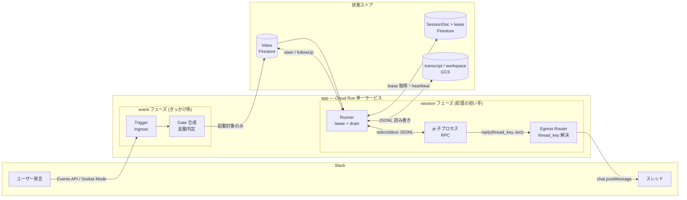
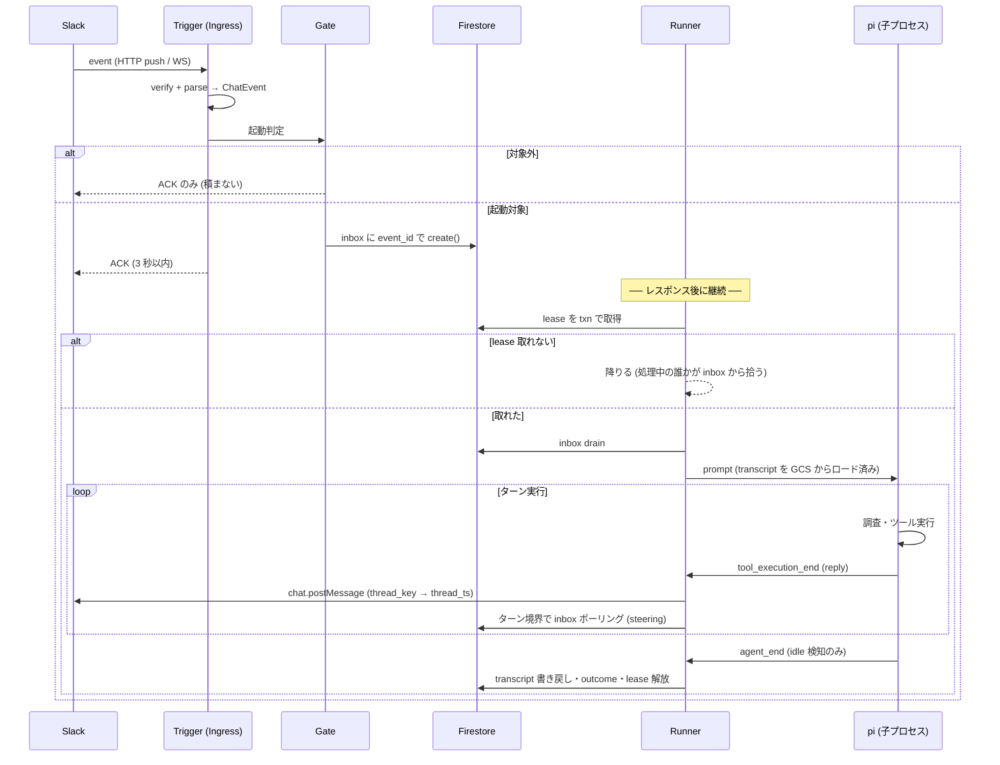
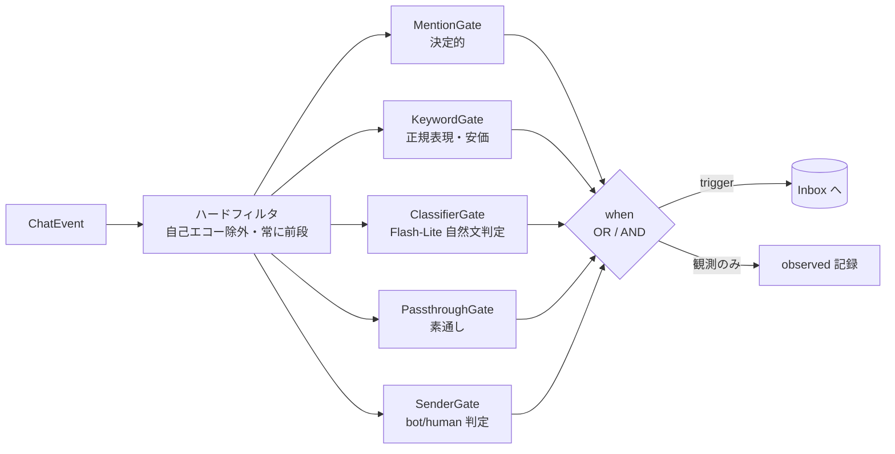
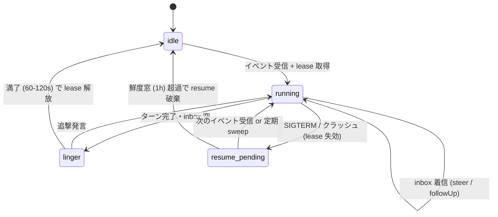
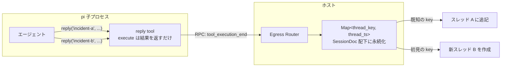

# コンポーネント構成 (README 用)

Slack のイベントを受けて [pi](https://github.com/earendil-works/pi) を駆動する、
サーバーレスなチャットエージェント基盤。Cloud Run (min-instances=0) 上で動き、
状態はすべて Firestore + GCS に置く。**プロセスは使い捨て、状態はストア** が全体の設計原則。

このドキュメントは全体像とコンポーネントの責務をまとめた README 素材。
詳細設計は [chat-model.md](chat-model.md) (チャットモデル) / [session-model.md](session-model.md)
(セッションモデル) / [architecture.md](architecture.md) (GCP 構成) を参照。

## 全体像

イベントは 4 つの抽象を順に通る: **Trigger** (どう届くか) → **Gate** (反応するか) →
**Inbox** (取りこぼさない) → **Session** (誰が処理するか)。処理側は **Runner** が pi を駆動し、
出力は **Reply** だけがユーザーに届く。



| 抽象 | 責務 | 具体 (本設計での実装) |
|---|---|---|
| **Trigger** | イベントがどう届くか・どう ACK するか | `HttpIngress` (Events API, 本番) / `SocketIngress` (Socket Mode, ローカル) |
| **Gate** | このイベントに反応するか | `MentionGate` / `KeywordGate` / `ClassifierGate` / `PassthroughGate` を any/all で合成 |
| **Inbox** | イベントを失わない耐久キュー + steering の受け口 | Firestore サブコレクション。doc ID = event_id で dedupe |
| **Session** | 会話のレーンと状態。誰が処理中か | `(channelId, threadTs)` = SessionDoc。lease + epoch で排他 |
| **Runner** | pi を駆動するホスト。drain → ターン実行 → 永続化 | pi RPC モード (子プロセス, stdin/stdout JSONL) |
| **Reply** | ユーザーに届く唯一の出力経路 | pi の `reply(thread_key, text)` tool + ホスト側 Router |
| **Config** | チャンネルごとの特化 | ChannelDoc: プロンプト / Gate 構成 / イメージ選択 / skill・MCP 有効化 / モデル |
| **Store** | プロセスの外に置く全状態 | Firestore (調整用メタデータ) + GCS (transcript / workspace / artifacts) |

## イベントの一生

メンション 1 発が返信になるまで。event フェーズと session フェーズは同一インスタンス内の
別フェーズ (レスポンス後に CPU always-allocated で継続)。



---

## Trigger — イベントの入口 ([architecture.md](architecture.md) §1)

**抽象**: イベントの「届き方」と「ACK の仕方」だけを差し替える。
後段 (Gate → Inbox → drain) は経路によらず共通。

```typescript
interface Ingress {
  start(onEvent: (e: ChatEvent, ack: Ack) => Promise<void>): Promise<void>;
  stop(): Promise<void>;
}
```

**具体**:

| 実装 | 経路 | ACK | 使いどころ |
|---|---|---|---|
| `HttpIngress` | Events API (HTTP push) | 200 応答 | Cloud Run 本番。scale-to-zero と両立 |
| `SocketIngress` | Socket Mode (WebSocket) | ack() コールバック | ローカル動作確認・公開 URL なしのお試し |

生ペイロード → `ChatEvent` の正規化はプラットフォーム方言の変換器 `IngressAdapter` が担い、
両 Ingress で共有する ([chat-model.md](chat-model.md) §3.2)。プラットフォーム追加 = IngressAdapter を書く、
受信経路追加 = Ingress を書く、という直交した拡張軸。

## Gate — 起動判定 ([session-model.md](session-model.md) §5)

**抽象**: 「このイベントに反応するか」の判定 1 単位。複数の Gate を並べて and/or で合成する。

```typescript
interface Gate {
  readonly name: string;
  decide(ctx: GateContext): Promise<TriggerDecision> | TriggerDecision;
}
// ChannelDoc 側: trigger.when (Gate の合成木。配列は OR、{and}/{or} で明示合成)
```

**具体**: ハードフィルタ (自己エコー除外) は常に前段に固定し、その後を合成する。
他 bot の投稿は `trigger.allowBots` (既定 false) が opt-in したチャンネルだけ
このハードフィルタを通り、Gate の合成に届く。



- 既定プリセット: `when: [{kind: mention}, {kind: classifier, criteria: ...}]`
  — メンションで即起動、なくても自然文条件に合えば起動 (配列 = OR)
- 安く絞る合成: `when: [{and: [{kind: keyword, pattern: ...}, {kind: classifier, criteria: ...}]}]`
  — 語句マッチした発言だけ LLM 判定に回す
- 配送後の最終ゲートは Gate ではなく**エージェント自身の沈黙** (reply を呼ばない自由)。
  Gate 合成 (配送前) と沈黙 (配送後) の二段で誤爆を防ぐ

## Inbox — 耐久キュー ([session-model.md](session-model.md) §4, [architecture.md](architecture.md) §2)

**抽象**: 「イベントを失わない」ことと「実行中セッションへの追加指示 (steering)」を
1 つの仕組みで賄う。realtime 通知には依存しない。

**具体**: `channels/{ch}/sessions/{threadTs}/inbox/{eventId}` (Firestore)。

- doc ID = Slack event_id → `create()` の失敗が Slack リトライの dedupe になる
- Runner は**ターン境界で 1 回 read** して steer / followUp を拾う (ポーリング)。
  steer の意味論が「次の LLM 呼び出し前に注入」なので、これより速い通知は使い道がない
- 拾う前に Runner が死んでも、inbox は残っているので次の lease 保持者の drain で必ず届く

## Session — レーンと排他 ([session-model.md](session-model.md) §1-4, [architecture.md](architecture.md) §2)

**抽象**: 3 つの分離がこの設計の核。

1. **sessionKey / sessionId** — レーン (不変) と実体 (compaction 等で回転) を分ける
2. **保存履歴 / 導出コンテキスト** — 保存は append-only、LLM に渡す形は毎回導出 (pi 方式)
3. **プロセス / 状態** — インスタンスはいつ死んでもよく、状態は Firestore + GCS で復元

**具体**: レーン = `(channelId, threadTs)`。スレッド root の ts がそのまま セッション ID。
transcript は GCS 上の JSONL (pi のセッションファイルそのもの)、Firestore にはメタデータのみ。

排他は lease (Firestore txn + epoch + heartbeat)。スケールアウトしても同じスレッドを
2 台が同時に走らせない。



すべての遷移は Firestore フィールドの更新で表現され、インスタンスの生死と独立。
再開に専用パスは無い — 「sessions doc が既存で lease が無い」だけなので、
受信フローがそのまま再開フローになる。

## Runner — pi の駆動 ([../research/pi-session-model.md](../research/pi-session-model.md), [architecture.md](architecture.md) §6)

**抽象**: エージェントループは自作しない。pi を RPC モード (子プロセス, stdin/stdout JSONL)
で起動し、ホストは「プロンプト投入・イベント購読・永続化」だけを担う。

**具体**:

- 起動時: GCS から transcript (JSONL) をロード → pi はそこから導出コンテキストを再構築
- ターン中: `steer` / `followUp` を pi の 2 段キューに積む (ターン境界ポーリングで拾ったもの)
- 終了判定: 「実行中ターン 0 / inbox 空 / バックグラウンド作業なし」の AND (hermes is_idle)
- 終了時: transcript を GCS に書き戻し、outcome (成果の要約) を SessionDoc へ

spawn の引数・env の掃除・workdir と flush・steering の RPC 配達の具体仕様は [session-runtime.md](session-runtime.md)。

## Reply — 唯一の出力経路 ([chat-model.md](chat-model.md) §5)

**抽象**: ユーザーに届く出力は pi の `reply(thread_key, text)` tool だけ。
地の文 (最終 assistant テキスト) は Slack に流さない。

- **複数回・逐次**: 1 ターン中に何度でも呼べる。複数タスクが来たら
  「1 つ目を調査 → reply → 2 つ目を調査 → reply」と逐次返す
- **thread_key は不透明**: エージェントは入力スレッドの ts をそのまま使っても、
  別話題に自作 slug を使ってもよい。1 セッション内に複数の出力スレッドが併存できる
- **宛先はホストが握る**: pi は thread_key を言うだけ。任意チャンネルへの自由 post はできない



`execute` は pi プロセス内で結果を返すだけで Slack を叩かない。実 post はホストが
RPC イベント (`tool_execution_end`) を購読して行う — WebClient と thread_key 対応表を
ホストに集約するため (salmon bridge 設計の実機検証済み判断)。

この構造により二重投稿対策は **受信 dedupe + lease 排他の 2 層**で足りる
(送信冪等化の層は不要になった。[architecture.md](architecture.md) §6)。

進捗表示 (👀 リアクション・edit ベースのステータス) は**別レーンのオプション**。
確定した返答は reply、実行中の可視化は edit、と役割が重ならない。

## Config — チャンネル特化 ([config.md](config.md), [architecture.md](architecture.md) §2)

**抽象**: **能力 = イメージ、振る舞い = Config、状態 = GCS** の 3 分割。
ChannelDoc は「振る舞いのテキスト」だけを持ち、能力 (skill・CLI・reply extension) は
イメージ内の固定パスに焼く。初期版はチャンネルごとの能力選択をしない ([config.md](config.md) §2-3)。

```typescript
interface ChannelDoc {
  systemPrompt?: string;   // 役割・口調・運用ルール
  context?: string[];      // 初回ターンに注入する短い参照テキスト
  trigger?: { when: WhenNode[] };  // Gate 合成木 (cooldownSec は実装保留中)
  session?: { mode?: "thread" | "channel"; affinity?: SessionAffinity };  // 単位と合流 ([session-model.md](session-model.md) §3)
  model?: string;          // pi の shorthand "provider/model-id[:thinking]" ([config.md](config.md) §2.3)
}
```

pi の起動 (kick) は spawn 引数への直接注入で、中間の設定ファイル生成は無い ([config.md](config.md) §4):

```
pi --mode rpc --session <workdir>/session.jsonl --model <ChannelDoc.model>
   --append-system-prompt <app 共通 + ChannelDoc.systemPrompt>
   --extension /app/extensions/reply.ts
```

設定の優先順位は 3 層 ([config.md](config.md) §4):

```
app 既定 (env) < ChannelDoc < セッション config_change
```

doc が無いチャンネルは既定動作 (mention 起動・既定イメージ)。secrets は Secret Manager の
名前参照のみで、pi settings の生パススルーは置かない (ホワイトリスト方式)。

記述は**リポジトリ内の YAML** (長文プロンプトは Markdown ファイル参照) で、bridge が直接読む
(`FileConfigSource`)。git がレビューと監査ログを兼ねる。
何をどこに置くかの判断基準・記述形式の詳細は [config.md](config.md)。

## Store — 状態の置き場所 ([architecture.md](architecture.md) §2-5)

| ストア | 置くもの | 理由 |
|---|---|---|
| Firestore | ChannelDoc / SessionDoc (status, lease, outcome) / inbox / ChannelStateDoc (enable/disable) | txn による排他と dedupe が要る調整データ |
| GCS (FUSE) | transcript (JSONL) / workspace (WIP) / artifacts (成果物) / docs | サイズが大きく追記中心。pi のファイル形式をそのまま使う |
| コンテナイメージ | pi 本体 / CLI / skill / reply extension (固定パス規約) | 能力はイメージのレビュー範囲に収める ([config.md](config.md) §3) |
| Secret Manager | Slack bot token / signing secret | 1 組織 1 ワークスペースなので 1 組だけ |

メッセージ本文は Firestore にミラーしない。会話履歴が要るときは Slack API から取り直し、
エージェントが見た文脈は transcript に残っている、という分担。

## 拡張の軸 (どこを書けば何が増えるか)

| 増やしたいもの | 書く場所 |
|---|---|
| 受信経路 (例: ポーリング型) | `Ingress` 実装 |
| プラットフォーム (例: Discord) | `IngressAdapter` + `EgressAdapter` 実装 |
| 起動条件の種類 | `Gate` 実装 (+ ChannelDoc の kind に追加) |
| チャンネルの振る舞い | channels/*.yaml を編集 (コード不要) |
| 実行環境 (ツール入り) / エージェントの能力 (skill) | コンテナイメージ (固定パスに焼く。チャンネル別イメージ・有効化選択は将来拡張 [config.md](config.md) §2) |
| MCP 相当の外部接続 | pi Extension を書いてイメージに同梱 (pi は MCP ネイティブ対応なし [config.md](config.md) §3) |
