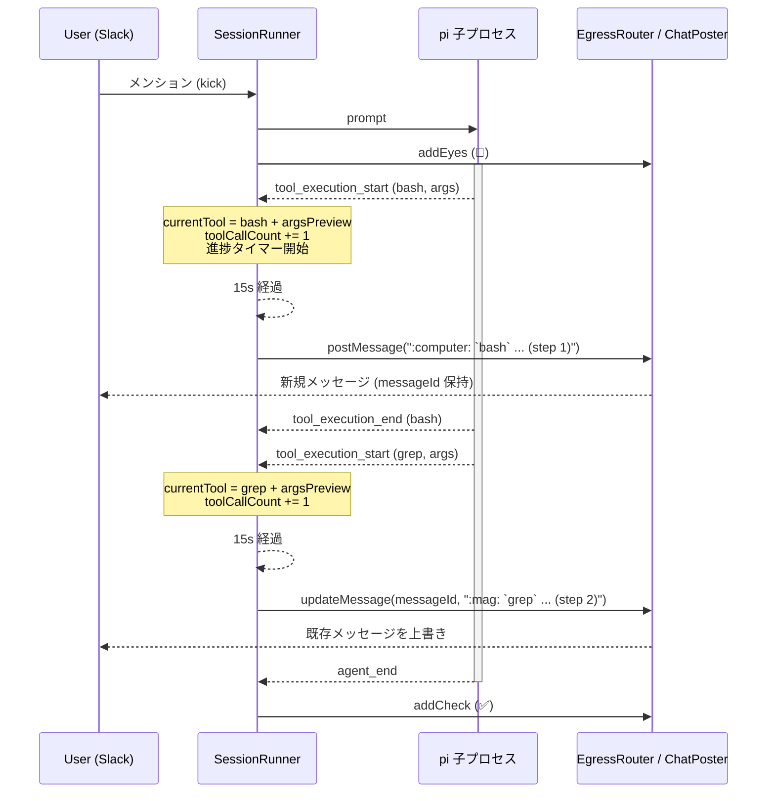

# Beacon — 長時間ターンの進捗通知

- Author: pokutuna
- Status: Draft
- Created: 2026-07-09
- URL: (発行後に記入)

## Objective

pi のターンが長引くとき、実行中であることと直前に何をしていたかを Slack 上の 1 通のメッセージ更新で示し、ユーザーが「固まったのか動いているのか」を判断できるようにする。

## Background

1 回のユーザー発言に対して pi エージェントが数分〜十数分実行され続けることがある。現在ユーザーに見えるのは、トリガーメッセージに付く 👀 (開始) と ✅/❌ (完了/異常終了) の 2 つのリアクションだけで ([architecture.md](architecture.md) §6、[session-model.md](session-model.md) §9)、その間の実行状態は完全に不透明である。長いツール呼び出し (大きなログ検索、複数ステップの調査など) が続くと、ユーザーは「エージェントが動いているのか、無応答でハングしているのか」を外から区別できない。

`chat-model.md` §5.4 では当初から「進捗表示は `reply` の出力とは別レーンとして残してよいが、初期段階では省き、長時間ターンの体感改善というオプションとして後から足す」という位置づけが明記されていた。本 Design Doc はこの「後から足す」を具体化する。

要望は次の 2 点に強く制約される (ユーザー指定):

- **LLM 呼び出しコストを増やさない**: エージェント自身に reply させる方式は、進捗を言語化させるために追加の推論を要求しがちで、コスト・レイテンシの両方に乗る。
- **session.jsonl (会話履歴) を汚さない**: 進捗通知のための発言や tool 呼び出しをエージェントの transcript に残したくない。再開時のコンテキストにノイズが増えるため。

この制約から、エージェントの推論を経由しない、ホスト (Runner) が pi の RPC イベントを観測するだけで組み立てられる通知に限定した。

## Goals

- 長時間ターンの間、ユーザーが実行中か否かを一目で判断できるようにする。
- 実行中の場合、直前に呼ばれたツール名・引数の冒頭・呼び出し回数程度の粗い情報を示し、「何かが起きている」ことを裏付ける。
- LLM 呼び出しを追加せず、session.jsonl に痕跡を残さないやり方で実現する。
- 将来 Slack 以外のチャット面 (Discord 等) を追加したときも同じ仕組みで動くよう、Egress の抽象を保つ。

## Non-Goals

- リアルタイムのトークンストリーミング表示はしない ([README.md](README.md) の既存 Non-Goals と同じ理由。本機能は十数秒間隔のスナップショット更新であり、トークン単位の逐次表示ではない — 両者は矛盾しない別カテゴリの機能として扱う)。
- ツール呼び出しの結果内容は表示しない (引数のプレビューまでとし、実行結果は出さない。結果は reply でユーザーに伝わる情報のみを想定しているため、途中経過の結果まで出すと機微データの露出面が増える)。
- 進捗通知メッセージの履歴は残さない (更新して消えるだけで、恒久的な記録にはしない。恒久的な記録は既存の `reply` が担う)。
- `reply` の出力経路や頻度は変更しない。本機能は `reply` とは別レーンの補助表示。

## Scenarios

1. ユーザーが `#ask-ai` で bot にメンションし、調査を依頼する。トリガーメッセージに 👀 が付く。
2. pi がログ検索を開始し、15 秒経過してもターンが終わらない。Runner がスレッドに新規メッセージ「:computer: `bash` `grep ERROR *.log` ... (step 1)」を投稿する (ツール名ごとの絵文字 + ツール名 + 引数のプレビュー + 累計呼び出し回数)。
3. さらに 15 秒後、ツールが切り替わっていた (呼び出しが完了していても、次に呼ばれるまでは直近のスナップショットを保持する)。Runner は同じメッセージを「:mag: `grep` `ERROR *.log` ... (step 2)」に上書きする (新規メッセージは増えない)。
4. ターンが開始してまだ一度もツールが呼ばれていない (LLM 呼び出し中など) 場合は「:thinking_face: ... (step 0)」を示す。「直前のツール」のような相対的な言い回しはユーザーにとって分かりにくいため使わない。
5. ターンが完了し `reply` が呼ばれる。Runner は進捗メッセージをそのまま残す (書き換え・削除はしない)。通常の `reply` 投稿とは別メッセージのまま残る。
6. 短いターン (通知の初回発火より前に完了する) では進捗メッセージは一度も投稿されない — 短時間で終わる大多数のやり取りに新たなノイズを追加しない。

## Diagrams



ソース: 上記コードブロックそのもの (mermaid)。

## Interfaces

契約面のみを要約する。

| インタフェース | 概要 |
|---|---|
| `ChatPoster.postMessage` (変更) | 戻り値を `Promise<void>` から `Promise<{ messageId: string }>` に変更する。Slack の `ts`、Discord の message id など、プラットフォームごとの「後から更新できる識別子」を `messageId` という共通抽象で表す |
| `ChatPoster.updateMessage` (新規) | `updateMessage(channelId: string, messageId: string, text: string): Promise<void>`。既存メッセージの本文を書き換える。Slack 実装は `chat.update` を叩く |
| Runner 内部の進捗状態 | `SessionRecord` に直近の `tool_execution_start` のスナップショット (ツール名・引数プレビュー `argsPreview`, 60 文字までの `preview()`) を保持するフィールドと、セッション累計のツール呼び出し回数 (`toolCallCount`) を追加する。`tool_execution_start` イベントの購読だけで更新し、LLM も session.jsonl も経由しない (`tool_execution_end` は状態遷移として追わない) |
| 進捗通知タイマー | セッション単位で動く間隔タイマー (既存の `startRenewTimer`/`resetTurnTimeout` と同じ `setInterval`/`unref` パターン)。発火時点のスナップショット (ツール名ごとの絵文字、ツール名、引数プレビュー、呼び出し回数) を投稿または更新する |

`ChatPoster` の新シグネチャ (擬似コード):

```typescript
export interface ChatPoster {
  postMessage(
    channelId: string,
    text: string,
    threadTs?: string,
    files?: string[],
  ): Promise<{ messageId: string }>;
  updateMessage(
    channelId: string,
    messageId: string,
    text: string,
  ): Promise<void>;
}
```

既存の `EgressRouter.deliver` (`reply` tool 経由の確定出力) は `postMessage` の戻り値を使わない (使い捨てでよい)。進捗通知は `EgressRouter` に別途追加するメソッド (例: `EgressRouter.notifyProgress(sessionKey, text)`) が `messageId` を憶えておき、初回は `postMessage`、以降は同じ `messageId` に対して `updateMessage` を呼ぶ。

## Dependencies / Infrastructure

- 追加の外部依存はない。既存の `@slack/web-api` `WebClient.chat.update` を使う。
- `tool_execution_start` イベントは現在 `piEventLogFields` (デバッグログ用) でのみ参照されている ([pi-events.ts](../../src/session/pi-events.ts))。本機能では `SessionRunner` の `proc.on("event", ...)` ハンドラに `isToolExecutionStart` の分岐を追加し、直接状態更新に使う。

## Timeline

| Step | マイルストーン |
|---|---|
| Step A | `ChatPoster` インターフェース変更 (`postMessage` 戻り値、`updateMessage` 追加)。`bridge.ts` の Slack 実装・テスト用フェイクを追従させる |
| Step B | `EgressRouter` に進捗通知用メソッドを追加 (thread_key → messageId の記憶、初回 post / 以降 update の切り替え) |
| Step C | `SessionRunner`: `tool_execution_start`/`end` の購読で `SessionRecord.currentTool` を更新。進捗タイマー (間隔・初回発火までの猶予を設定可能に) を実装し、ターン終了時にタイマー停止とメッセージの後始末を行う |
| Step D | 実運用確認 (`examples/gc-logging-agent` 等の長時間ツールを持つ example で目視確認) |

## Related Documents

- [chat-model.md](chat-model.md) §5.4 — 「進捗表示は任意 (出力とは別レーン)」の既存構想。本ドキュメントはこの具体化
- [session-runtime.md](session-runtime.md) §6 — タイマーによる異常系制御 (turn timeout) と同種のパターン
- [README.md](README.md) — Non-Goals の「リアルタイムのストリーミング表示はしない」との関係を明記

## Resolved Issues

- **通知間隔と初回発火までの猶予**: 既定 15 秒 (初回発火の猶予・以降の更新間隔ともに同じ値を使う) とし、`SessionRunnerOptions.progressNoticeIntervalMs` として override 可能にする。他の間隔設定 (`leaseTtlMs`/`lingerMs`/`turnTimeoutMs`) と同じ「コードに既定値 1 箇所、options で上書き可」の流儀に揃える。実運用で体感を見て調整する前提の値であり、決定自体の cost は低い (設定値なので数分で直せる)。
- **設定経路と有効/無効の切り替え**: `turnTimeoutMs` と同じ経路 (`agent.yaml` の `pi.progressNoticeIntervalMs` + env `PROGRESS_NOTICE_INTERVAL_MS`。優先順位 env > agent.yaml > コード既定 600000/15000 系と同形) に一本化する。`connector.slack` (Slack 接続情報専用ブロック) には置かない — 進捗通知の実体 (`SessionRunner`/`EgressRouter`/`ChatPoster`) はプラットフォーム中立で、Slack 固有なのは `bridge.ts` の `chat.update` 呼び出し 1 箇所だけのため、実行時パラメータは `pi` ブロック側が実態に合う。`0` を指定すると `resetProgressNotice` がタイマーを張らず機能自体を無効化する (負値は指定しない想定)。
- **ターン終了時の進捗メッセージの扱い**: 書き換えて残す方式に決定。削除は `chat.delete` 権限が追加で要り、Slack App のスコープを増やすことになる。書き換え (例: 最終状態は特に何も上書きしない — `reply` が別メッセージとして出るので、進捗メッセージは投稿した最後の内容のまま静かに残ってよい) の方が権限追加なしで実装できる。
- **同一ターン内で複数の `thread_key` に reply が飛ぶケースとの関係**: 進捗通知はセッション単位 (1 つ) であり、reply の宛先分岐 ([chat-model.md](chat-model.md) §5.3) とは独立させる。進捗メッセージ自体は常にトリガーメッセージのスレッド (またはセッションの既定宛先、sessionKey の登録先) に出す。
- **通知本文の情報量**: 実運用 (個人用 Slack ワークスペースでの動作確認) で「ツール名のみ」「直前のツール」といった表現がユーザーにとって分かりにくいと判明したため、`tool_execution_start` イベントの `args` を全ツール共通で `preview()` (60 文字まで切り詰め) した文字列と、セッション累計のツール呼び出し回数 (`toolCallCount`) を追加した。ツール限定の特別扱い (例: bash のコマンド冒頭だけ特別扱いする) はせず、`piEventLogFields` の既存 `preview()` ユーティリティをそのまま流用する汎用実装にした。引数に機微情報が含まれる可能性は残るが、宛先は元々アクセス制御された Slack スレッドであり、`reply` の出力と同等の信頼境界として扱う。
  - 例外として `reply` ツールだけは `argsPreview` を出さない (ツール名のみ表示)。`reply` の `args` にはユーザーへの返信本文がそのまま入っており、60 文字で切った JSON をプレビューに出すと本来の `reply` 投稿 (直後に別メッセージとして届く) と内容が重複・矮小化して見えるため。
- **通知本文の形式・実行中/合間の区別**: 「実行中」「考え中 (直前のツール: ...)」のように状態を分けて相対的な言葉 (直前) で説明する表現は分かりにくいとの指摘を受け、`{emoji} {tool.name} {argsPreview} ... (step {toolCallCount})` という単一形式に統一した。`currentTool` は直近の `tool_execution_start` のスナップショットを保持するだけで、`tool_execution_end` による running/完了の状態遷移は追わない。絵文字はツール名で分類する (`bash` → :computer:、`read`/`grep`/`glob` → :mag:、`write`/`edit` → :memo:、`reply` → :speech_balloon:、その他 → :gear:。まだツールが呼ばれていない場合は :thinking_face:)。

## Alternatives Considered

#### B案: エージェント自身に reply させる (タイマーで「進捗を報告して」と steer する)
- Pros: 既存の `reply` 経路をそのまま使え、ホスト側の新規実装が少ない
- Cons: 進捗を言語化させるために追加の LLM 呼び出しが発生し、コストと session.jsonl の汚染の両方でユーザーの制約に反する。不採用

#### 都度新規メッセージを投稿する (chat.update を使わない)
- Pros: 実装が `postMessage` の戻り値変更なしで済む
- Cons: 長時間ターンでは同じ内容のメッセージがスレッドに何通も溜まり、ノイズになる。世の中の類似 AI ボット (Cursor/Devin 等) は単一メッセージの編集で進捗を示すのが一般的な UX であり、それに揃える

#### `AgentStreamEvent` (`tool_progress` 等) をフルに使ったリッチな進捗表示
- Pros: `chat-model.md` §5.1 に既に型が用意されている
- Cons: `tool_execution_start`/`end` の購読だけで「ツール名 + 引数プレビュー + 呼び出し回数」は十分に表現でき、追加のイベント購読は不要だった。ストリーミング差分 (`message_update`/`tool_execution_update`) まで拾うのは Non-Goals のトークンストリーミング表示と競合するため見送る
