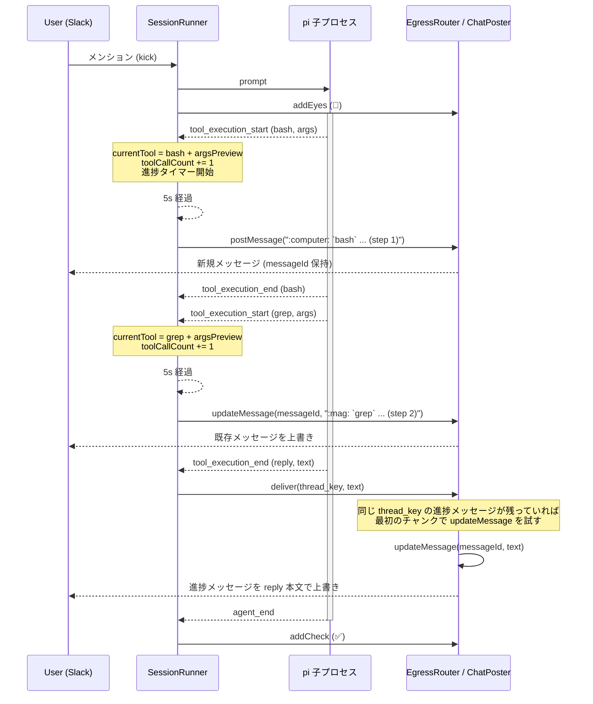

# Beacon — 長時間ターンの進捗通知

- Author: pokutuna
- Status: Draft
- Created: 2026-07-09
- URL: (発行後に記入)

## Objective

pi のターンが長引くとき、実行中であることと直前に何をしていたかを Slack 上の 1 通のメッセージ更新で示し、ユーザーが「固まったのか動いているのか」を判断できるようにする。

## Background

1 回のユーザー発言に対して pi エージェントが数分〜十数分実行され続けることがある。現在ユーザーに見えるのは、トリガーメッセージに付く 👀 (開始) と ✅/❌ (完了/異常終了) の 2 つのリアクションだけで ([architecture.md](architecture.md) §6、[session-model.md](session-model.md) §9)、その間の実行状態は完全に不透明である。長いツール呼び出し (大きなログ検索、複数ステップの調査など) が続くと、ユーザーは「エージェントが動いているのか、無応答でハングしているのか」を外から区別できない。

`chat-model.md` §5.4 では当初から「進捗表示は `reply` の出力とは別レーンとして残してよいが、初期段階では省き、長時間ターンの体感改善というオプションとして後から足す」という位置づけが明記されていた。本 Design Doc はこの「後から足す」を具体化する。

要望は次の 2 点に強く制約される (ユーザー指定):

- **LLM 呼び出しコストを増やさない**: エージェント自身に reply させる方式は、進捗を言語化させるために追加の推論を要求しがちで、コスト・レイテンシの両方に乗る。
- **session.jsonl (会話履歴) を汚さない**: 進捗通知のための発言や tool 呼び出しをエージェントの transcript に残したくない。再開時のコンテキストにノイズが増えるため。

この制約から、エージェントの推論を経由しない、ホスト (Runner) が pi の RPC イベントを観測するだけで組み立てられる通知に限定した。

## Goals

- 長時間ターンの間、ユーザーが実行中か否かを一目で判断できるようにする。
- 実行中の場合、直前に呼ばれたツール名・引数の冒頭・呼び出し回数程度の粗い情報を示し、「何かが起きている」ことを裏付ける。
- LLM 呼び出しを追加せず、session.jsonl に痕跡を残さないやり方で実現する。
- 将来 Slack 以外のチャット面 (Discord 等) を追加したときも同じ仕組みで動くよう、Egress の抽象を保つ。

## Non-Goals

- リアルタイムのトークンストリーミング表示はしない ([README.md](README.md) の既存 Non-Goals と同じ理由。本機能は十数秒間隔のスナップショット更新であり、トークン単位の逐次表示ではない — 両者は矛盾しない別カテゴリの機能として扱う)。
- ツール呼び出しの結果内容は表示しない (引数のプレビューまでとし、実行結果は出さない。結果は reply でユーザーに伝わる情報のみを想定しているため、途中経過の結果まで出すと機微データの露出面が増える)。
- 進捗通知メッセージの履歴は残さない (更新して消えるだけで、恒久的な記録にはしない。恒久的な記録は既存の `reply` が担う)。
- `reply` の出力経路や頻度は変更しない。本機能は `reply` とは別レーンの補助表示。

## Scenarios

1. ユーザーが `#ask-ai` で bot にメンションし、調査を依頼する。トリガーメッセージに 👀 が付く。
2. pi がログ検索を開始し、5 秒経過してもターンが終わらない。Runner がスレッドに新規メッセージ「:computer: `bash` `grep ERROR *.log` ... (step 1)」を投稿する (ツール名ごとの絵文字 + ツール名 + 引数のプレビュー + 累計呼び出し回数)。
3. さらに 5 秒後、ツールが切り替わっていた (呼び出しが完了していても、次に呼ばれるまでは直近のスナップショットを保持する)。Runner は同じメッセージを「:mag: `grep` `ERROR *.log` ... (step 2)」に上書きする (新規メッセージは増えない)。
4. ターンが開始してまだ一度もツールが呼ばれていない (LLM 呼び出し中など) 場合は「:thinking_face: ... (step 0)」を示す。「直前のツール」のような相対的な言い回しはユーザーにとって分かりにくいため使わない。
5. ターンが完了し `reply` が呼ばれる。同じ thread_key に進捗メッセージが残っていれば、`reply` の本文でその進捗メッセージを上書きする (「実行中...」の表示がスレッドに残り続けるのを避ける)。上書きに使うのは `reply` テキストの最初のチャンクのみで、`files` が付く場合は上書き対象にしない (`updateMessage` が files 添付に対応しないため常に新規投稿する)。上書きに失敗した場合、または対象の進捗メッセージが無い場合は通常どおり新規投稿する。
6. 短いターン (通知の初回発火より前に完了する) では進捗メッセージは一度も投稿されず、`reply` は最初から新規投稿になる — 短時間で終わる大多数のやり取りに新たなノイズを追加しない。

## Diagrams



ソース: 上記コードブロックそのもの (mermaid)。

## Interfaces

契約面のみを要約する。

| インタフェース | 概要 |
|---|---|
| `ChatPoster.postMessage` (変更) | 戻り値を `Promise<void>` から `Promise<{ messageId: string }>` に変更する。Slack の `ts`、Discord の message id など、プラットフォームごとの「後から更新できる識別子」を `messageId` という共通抽象で表す |
| `ChatPoster.updateMessage` (新規) | `updateMessage(channelId: string, messageId: string, text: string): Promise<void>`。既存メッセージの本文を書き換える。Slack 実装は `chat.update` を叩く |
| Runner 内部の進捗状態 | `SessionRecord` に直近の `tool_execution_start` のスナップショット (ツール名・絵文字 `emoji`・引数プレビュー `argsPreview`, 60 文字までの `toolArgsPreview()`) を保持するフィールドと、セッション累計のツール呼び出し回数 (`toolCallCount`)、直前送信テキスト (`lastProgressNoticeText`) を追加する。`tool_execution_start` イベントの購読だけで更新し、LLM も session.jsonl も経由しない (`tool_execution_end` は状態遷移として追わない)。`reply` ツールの `tool_execution_start` は `currentTool`/`toolCallCount` のどちらも更新せず無視する — `reply` は最終回答を作っている段階であり進捗表示の対象外のため (進捗はそのターンで直前に完了していた他ツールのスナップショットのまま据え置かれる) |
| 進捗通知タイマー | セッション単位で動く間隔タイマー (既存の `startRenewTimer`/`resetTurnTimeout` と同じ `setInterval`/`unref` パターン)。発火時点のスナップショット (ツール名ごとの絵文字、ツール名、引数プレビュー、呼び出し回数) を組み立て、直前送信テキストと同一なら送信をスキップし、異なる場合のみ投稿または更新する |
| `EgressRouter.deliver` (拡張) | `reply` の最初のチャンク (`files` 無し) は、進捗キー (既定は payload の `thread_key`) に進捗メッセージが残っており、実際の投稿先も同じなら `updateMessage` でそれを上書きする。`session.mode=channel` のように進捗をセッションキーで出し、reply はメッセージ単位のキーで返す場合は `SessionRunner` がセッションキーを進捗キーとして渡す。上書きに成功したら通常の `postMessage` はスキップする。進捗メッセージが無い/投稿先が異なる/上書きに失敗した場合は通常どおり `postMessage` で新規投稿する |
| thread_key ごとの直列化 | `EgressRouter` は `notifyProgress`/`deliver`/`clearProgress`/`reopenProgress` を進捗キー単位の FIFO キューで直列化する。進捗タイマーの tick と `reply` の配送は別々の非同期経路から発火するため、キューを介さず `progressMessageIds` を直接読み書きすると、配送済みの `reply` の後に古いスナップショットの tick が新規メッセージを再投稿してしまう |
| 進捗レーンの閉鎖/再開 | `EgressRouter` は進捗キーごとの閉鎖フラグ (`progressClosed`) を持つ。`deliver` はキュー直列化があっても「配送直後にキューへ積まれた tick」まではブロックできないため、`deliverNow` の冒頭 (destination 解決より前) でそのキーを閉じる。`notifyProgressNow` は閉じているキーに対しては投稿/更新を行わず何もしない。`EgressRouter.reopenProgress(threadKey): Promise<void>` は同じキューを経由してこのキーを再び開く — キューを通すことで、閉鎖前からキューに残っていた前ターンの遅延 tick は reopen より先に処理されて閉鎖中として破棄され、reopen 後に積まれた新ターンの tick だけが通る。`SessionRunner` はターン開始のたびに (`resetProgressNotice` から) `reopenProgress` を呼ぶ。`clearProgress` (セッション終了時) も併せて閉鎖を解除し、次セッションが同じキーを再利用したときに閉鎖状態が残らないようにする。一度も `deliver` していないキーは閉鎖されていないため、初回ターンの tick は従来どおり流れる |

`ChatPoster` の新シグネチャ (擬似コード):

```typescript
export interface ChatPoster {
  postMessage(
    channelId: string,
    text: string,
    threadTs?: string,
    files?: string[],
  ): Promise<{ messageId: string }>;
  updateMessage(
    channelId: string,
    messageId: string,
    text: string,
  ): Promise<void>;
}
```

既存の `EgressRouter.deliver` (`reply` tool 経由の確定出力) は `postMessage` の戻り値を使わない (使い捨てでよい)。進捗通知は `EgressRouter` に別途追加するメソッド (例: `EgressRouter.notifyProgress(sessionKey, text)`) が `messageId` を憶えておき、初回は `postMessage`、以降は同じ `messageId` に対して `updateMessage` を呼ぶ。

## Dependencies / Infrastructure

- 追加の外部依存はない。既存の `@slack/web-api` `WebClient.chat.update` を使う。
- `tool_execution_start` イベントは現在 `piEventLogFields` (デバッグログ用) でのみ参照されている ([pi-events.ts](../../src/session/pi-events.ts))。本機能では `SessionRunner` の `proc.on("event", ...)` ハンドラに `isToolExecutionStart` の分岐を追加し、直接状態更新に使う。

## Timeline

| Step | マイルストーン |
|---|---|
| Step A | `ChatPoster` インターフェース変更 (`postMessage` 戻り値、`updateMessage` 追加)。`bridge.ts` の Slack 実装・テスト用フェイクを追従させる |
| Step B | `EgressRouter` に進捗通知用メソッドを追加 (thread_key → messageId の記憶、初回 post / 以降 update の切り替え) |
| Step C | `SessionRunner`: `tool_execution_start`/`end` の購読で `SessionRecord.currentTool` を更新。進捗タイマー (間隔・初回発火までの猶予を設定可能に) を実装し、ターン終了時にタイマー停止とメッセージの後始末を行う |
| Step D | 実運用確認 (`examples/gc-logging-agent` 等の長時間ツールを持つ example で目視確認) |

## Related Documents

- [chat-model.md](chat-model.md) §5.4 — 「進捗表示は任意 (出力とは別レーン)」の既存構想。本ドキュメントはこの具体化
- [session-runtime.md](session-runtime.md) §6 — タイマーによる異常系制御 (turn timeout) と同種のパターン
- [README.md](README.md) — Non-Goals の「リアルタイムのストリーミング表示はしない」との関係を明記

## Resolved Issues

- **通知間隔と初回発火までの猶予**: 既定 5 秒 (初回発火の猶予・以降の更新間隔ともに同じ値を使う) とし、`SessionRunnerOptions.progressNoticeIntervalMs` として override 可能にする。他の間隔設定 (`leaseTtlMs`/`lingerMs`/`turnTimeoutMs`) と同じ「コードに既定値 1 箇所、options で上書き可」の流儀に揃える。実運用で体感を見て調整する前提の値であり、決定自体の cost は低い (設定値なので数分で直せる)。
- **設定経路と有効/無効の切り替え**: `turnTimeoutMs` と同じ経路 (`agent.yaml` の `agent.progressNoticeIntervalMs` + env `PROGRESS_NOTICE_INTERVAL_MS`。優先順位 env > agent.yaml > コード既定 600000/5000 系と同形) に一本化する。`connector.slack` (Slack 接続情報専用ブロック) には置かない — 進捗通知の実体 (`SessionRunner`/`EgressRouter`/`ChatPoster`) はプラットフォーム中立で、Slack 固有なのは `bridge.ts` の `chat.update` 呼び出し 1 箇所だけのため、実行時パラメータは `agent` ブロック側が実態に合う。`0` を指定すると `resetProgressNotice` がタイマーを張らず機能自体を無効化する (負値は指定しない想定)。
- **ターン終了時の進捗メッセージの扱い**: 最終的に `reply` の本文で上書きする方式に決定 (当初検討した「書き換えずそのまま残す」から変更)。「実行中...」の表示が完了後もスレッドに残り続けるのはユーザー体験として良くないとの指摘を受けた。削除 (`chat.delete`) は Slack App のスコープ追加が要るため見送り、既存の `updateMessage` だけで実現できる上書きを選んだ。対象は進捗キーに対応する `reply` のみで、キーが異なっても投稿先が同じなら上書きする (DM の `session=channel` + `reply=flat` が該当)。別スレッドの進捗メッセージには影響しない。複数チャンクに分かれる場合は最初のチャンクだけを上書き対象にし、残りは新規投稿する (`updateMessage` が `files` 添付に対応しないため、`files` を伴うチャンクも常に新規投稿する)。上書きが失敗した場合は通常の新規投稿にフォールバックし、`reply` が届かないことは無い。
- **進捗タイマーと `reply` 配送の競合**: 進捗タイマー (`setInterval`) と `reply` の配送 (`tool_execution_end` 起点) は別々の非同期経路から同じ進捗キーに対して発火しうる。`EgressRouter` は `notifyProgress`/`deliver`/`clearProgress`/`reopenProgress` を進捗キー単位の FIFO キューで直列化し、呼ばれた順に完了させることで `progressMessageIds` の読み書き順序は保証する。ただし直列化だけでは「`reply` の配送直後にキューへ積まれた進捗タイマーの tick」は防げない (その tick は配送済みの進捗メッセージが跡形もなく消費された後の stale なスナップショットである)。これを塞ぐのが上記の進捗レーンの閉鎖/再開で、`deliverNow` がキーを閉じ、閉鎖中の `notifyProgressNow` は何もしない。`SessionRunner` はターン開始 (`resetProgressNotice`) のたびに `reopenProgress` でレーンを開き直し、`agent_end`/`tool_execution_end` (reply) を受けた時点で `clearProgressNotice` によりタイマー自体も即座に止める (`onAgentEnd` の非同期な後片付けの完了は待たない)。
- **同一ターン内で複数の `thread_key` に reply が飛ぶケースとの関係**: 進捗通知はセッション単位 (1 つ) であり、reply の宛先分岐 ([chat-model.md](chat-model.md) §5.3) とは独立させる。進捗メッセージ自体は常にトリガーメッセージのスレッド (またはセッションの既定宛先、sessionKey の登録先) に出す。
- **通知本文の情報量**: 実運用 (個人用 Slack ワークスペースでの動作確認) で「ツール名のみ」「直前のツール」といった表現がユーザーにとって分かりにくいと判明したため、`tool_execution_start` イベントの `args` を `preview()` (60 文字まで切り詰め) した文字列と、セッション累計のツール呼び出し回数 (`toolCallCount`) を追加した。引数に機微情報が含まれる可能性は残るが、宛先は元々アクセス制御された Slack スレッドであり、`reply` の出力と同等の信頼境界として扱う。
  - `reply` ツールは `tool_execution_start` の時点で `currentTool`/`toolCallCount` の更新自体をスキップする (`argsPreview` を出さない、という以前の例外的な扱いから、進捗表示に一切反映しない扱いに変更した)。`reply` は「最終回答を作っている」段階であり進捗として表示する意味が薄く、`reply` の args にはユーザーへの返信本文がそのまま入っているため、直後に別メッセージとして届く本来の `reply` 投稿と内容が重複・矮小化して見える上、`reply` 実行中のスナップショットが (ターン終盤で他のツールが呼ばれないまま) 最後の進捗表示として残ると紛らわしい。ターン最初のツールが `reply` の場合、`currentTool` は `undefined` のままなので `:thinking_face: ... (step 0)` 側の表示になる。
  - pi 組み込みツール (`bash`/`read`/`write`/`edit`/`grep`/`find`/`ls`) は主要な引数キー1つの値だけを抜き出す (`bash` → `command`、`read`/`write`/`edit`/`ls` → `path`、`grep`/`find` → `pattern`)。`{"command":"..."}` のようなキー名込みの JSON 表示は冗長との指摘を受けたため。組み込み以外の (extension 由来の) ツールはキー構成を把握できないので `preview()` の汎用 JSON 表示にフォールバックする。
- **通知本文の形式・実行中/合間の区別**: 「実行中」「考え中 (直前のツール: ...)」のように状態を分けて相対的な言葉 (直前) で説明する表現は分かりにくいとの指摘を受け、`{emoji} {tool.name} {argsPreview} ... (step {toolCallCount})` という単一形式に統一した。`currentTool` は直近の `tool_execution_start` のスナップショットを保持するだけで、`tool_execution_end` による running/完了の状態遷移は追わない。絵文字はツール名で分類する (`bash` → :computer:/:keyboard:/:zap:/:gear:/:hammer_and_wrench:/:rocket:/:robot_face:/:satellite: からランダムに1つ、`read`/`grep`/`find`/`ls` → :mag:、`write`/`edit` → :memo:、その他 → :gear:。まだツールが呼ばれていない場合は :thinking_face:。`reply` は進捗表示の対象外のためこの絵文字分類にも出てこない)。
  - `bash` は最も頻出するツールで進捗通知に固定の絵文字が何度も出て単調になるため、呼び出し (`tool_execution_start`) ごとに候補からランダムに1つ選ぶ。選んだ絵文字は `currentTool.emoji` に保存し、以降のタイマー tick (同じツール呼び出しが継続中) では選び直さない — タイマー発火のたびに選び直すと、同じ bash 実行中に表示がちらつくため。
- **同じ内容が続く場合の再送**: タイマー間隔を 15 秒から 5 秒に短縮するにあたり、間隔を短くしただけでは状況が進んでいなくても Slack API を呼び続けてしまう。そこで `SessionRecord` に直前送信テキスト (`lastProgressNoticeText`) を持たせ、tick 発火時に今回のテキストと比較して同一なら送信をスキップする (`notifyProgress` 自体を呼ばない)。ターンが切り替わったとき (`resetProgressNotice` 呼び出し時) は前ターンの記憶をクリアし、新しいターンの1回目は必ず比較なしで送れるようにする。

## Alternatives Considered

#### B案: エージェント自身に reply させる (タイマーで「進捗を報告して」と steer する)
- Pros: 既存の `reply` 経路をそのまま使え、ホスト側の新規実装が少ない
- Cons: 進捗を言語化させるために追加の LLM 呼び出しが発生し、コストと session.jsonl の汚染の両方でユーザーの制約に反する。不採用

#### 都度新規メッセージを投稿する (chat.update を使わない)
- Pros: 実装が `postMessage` の戻り値変更なしで済む
- Cons: 長時間ターンでは同じ内容のメッセージがスレッドに何通も溜まり、ノイズになる。世の中の類似 AI ボット (Cursor/Devin 等) は単一メッセージの編集で進捗を示すのが一般的な UX であり、それに揃える

#### `AgentStreamEvent` (`tool_progress` 等) をフルに使ったリッチな進捗表示
- Pros: `chat-model.md` §5.1 に既に型が用意されている
- Cons: `tool_execution_start`/`end` の購読だけで「ツール名 + 引数プレビュー + 呼び出し回数」は十分に表現でき、追加のイベント購読は不要だった。ストリーミング差分 (`message_update`/`tool_execution_update`) まで拾うのは Non-Goals のトークンストリーミング表示と競合するため見送る
