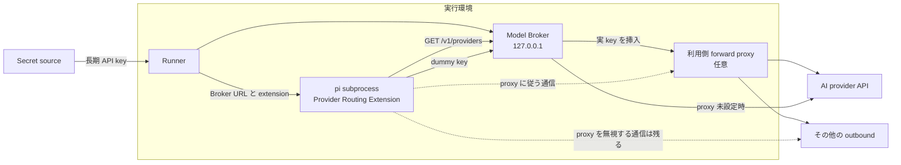

# Model Broker

- Author: pokutuna
- Status: Draft
- Created: 2026-07-21
- URL: 発行後に記入

## Objective

自由な入力と任意コマンドを受け付ける pi に長期 API key を渡さず、多様な AI provider を設定だけで利用できるようにする。

## Decision

pi-chat-runner は、runner process 内にモデル API 専用の **Model Broker** を持つ。

ここでいう Model Broker は、oh-my-pi の **Auth Broker** とは役割が異なる。
本書の Model Broker は pi の推論 request を受ける gateway であり、oh-my-pi の Auth Broker は credential の snapshot と refresh を提供する管理 API である。

Model Broker は loopback で待ち受け、固定した upstream へ request を転送するときに API key を header として挿入する。
pi は Model Broker を自由に呼べるが、長期 API key は知らない。

Model Broker server、CLI、共有 contract、**Provider Routing Extension** は一つの独立した npm package として提供する。
extension は Model Broker から provider 一覧を取得し、provider ごとに `pi.registerProvider()` を呼んで pi の接続先を Model Broker へ向ける。
pi-chat-runner は同じ package から Broker server library と extension を利用する。
他の host は Broker CLI と extension を組み合わせて利用できる。

OpenAI、Anthropic、OpenRouter などの違いは、Model Broker の設定を複数並べて表現する。
Model Broker は provider 名に固有の処理を持たず、固定 upstream URL と上流へ設定する header だけを扱う。

`PI_MODEL_BROKER_URL` は provider API の `baseUrl` ではなく、Broker の discovery root とする。
推奨値は `http://127.0.0.1:<ephemeral-port>/` である。
provider ごとに必要な `/v1`、`/api/v1`、`/v1beta` などは manifest が個別の `baseUrl` として返す。

```text
pi
  │ provider request
  ▼
Provider Routing Extension が登録した loopback URL
  │
  ▼
Model Broker
  │ 固定 upstream を選択
  │ dummy の認証 header を実 credential で上書き
  ▼
OpenAI / Anthropic / OpenRouter / 任意の互換 API
```

forward proxy は Model Broker と別の機能として扱う。
利用側が proxy を用意した場合、Model Broker の upstream 通信と、proxy 環境変数に従う pi の通信をそこへ流せるようにする。

## Background

現在の `agent.env` は、runner の全環境変数を pi へ継承しないための足し算方式になっている。
しかし `OPENAI_API_KEY` などを `agent.env` に追加すると、pi の bash tool からその値を読める。

API key を pi の file、spawn 引数、`auth.json` へ移しても解決しない。
pi が利用できる長期 credential は、pi が実行する任意 command からも到達できるためである。

現行 pi の extension API は、[`pi.registerProvider()` で built-in provider の `baseUrl` と request header を上書きできる](https://github.com/earendil-works/pi/blob/main/packages/coding-agent/docs/extensions.md#piregisterprovidername-config)。
extension 初期化中の provider 登録は CLI の model 解決より前に反映される。
この API を使えば、利用者の `models.json` や `PI_CODING_AGENT_DIR` を変更せずに接続先を差し替えられる。

## Investigation Results

### pi が既に提供しているもの

pi は proxy 経由の provider 利用を既にサポートしている。
`models.json` または extension の `pi.registerProvider()` で built-in provider の `baseUrl` だけを上書きすると、built-in model catalog、API adapter、model ごとの互換性設定を維持したまま接続先を変更できる。

したがって、新しく実装する必要があるのは pi の provider abstraction ではない。
長期 credential を pi process の外で保持して request に挿入する Broker と、その複数の `baseUrl` override を配る薄い設定層だけである。

extension も必須ではない。
runner が管理する `models.json` に同じ override と dummy key を書けば動作する。
ただし pi-chat-runner は中間設定ファイルを生成しない設計であり、独立した pi package として他の host でも再利用できるため、本提案では薄い extension を選ぶ。

### provider と credential の解決順

pi の起動と request は次の順序で解決される。

1. async extension factory の完了を待つ。
2. `pi.registerProvider()` の登録を model registry に反映する。
3. `--model provider/model-id` を解決する。
4. request 時に provider の credential を解決する。
5. model が持つ API adapter が登録後の `baseUrl` へ request を送る。

credential の優先順位は、`--api-key`、`auth.json`、process environment、custom provider の `apiKey` の順である。
extension が設定する dummy key は最後の fallback にすぎない。

この repository が固定している pi 0.79.9 で、空の `PI_CODING_AGENT_DIR`、`PI_OFFLINE=1`、次の provider override を使って実測した。

```typescript
pi.registerProvider("openai", {
  baseUrl: "http://127.0.0.1:43127/providers/openai/v1",
  apiKey: "broker-placeholder",
});
```

結果は次のとおりである。

- `--list-models openai` は built-in OpenAI model を列挙し、credential 不足では停止しなかった。
- `openai/gpt-4` の request は `POST /providers/openai/v1/responses` へ送られた。
- 空の環境では `Authorization: Bearer broker-placeholder` が送られた。
- `OPENAI_API_KEY` を与えると、その値が dummy key より優先されて送られた。

したがって Broker mode では、対象 provider の credential 環境変数を allowlist へ入れないだけでなく、pi が見る `auth.json` も credential を含まない管理下のものにしなければならない。
pi-chat-runner の現在の env 足し算方式と専用 HOME はこの前提に合う。
独立 extension を通常の pi CLI で使う場合も、利用者は同じ前提を満たす必要がある。

### oh-my-pi が提供しているもの

oh-my-pi は、既に Auth Broker と Auth Gateway の二層を実装している。

- `OMP_AUTH_BROKER_URL` は `/v1/snapshot` や `/v1/credential/:id/refresh` を持つ credential 管理 API の root であり、pi provider の `baseUrl` にはできない。
- `omp auth-gateway serve` は既定で `127.0.0.1:4000` に待ち受け、`/v1/chat/completions`、`/v1/responses`、`/v1/messages`、`/v1/pi/stream` を提供する。
- Gateway は raw passthrough ではなく、入力を内部 context へ変換して `pi-ai` の provider 実装で送信し、response を再変換する。
- stock pi には `OMP_AUTH_BROKER_URL` を解釈して credential store を差し替える機能はない。これは oh-my-pi 側の実装である。

oh-my-pi の Auth Gateway を loopback で `--no-auth` として起動し、stock pi の provider `baseUrl` を各 adapter に合う Gateway URL へ向ける構成は可能である。
例えば OpenAI-compatible adapter は `<gateway>/v1`、Anthropic adapter は `<gateway>` を使う。
これは OAuth refresh、複数 account の選択、provider 固有 request shaping まで必要な場合の有力な sidecar である。

一方、静的 API key を header に差し込むだけの初期要件には重い。
また、その Gateway の bearer token を pi に渡す構成では upstream key の代わりに Gateway capability が露出するため、今回の同居構成では loopback の認証なし endpoint を使う必要がある。
本提案は oh-my-pi の wire API を必須依存にせず、必要なら Model Broker の代わりに差し替えられる形にする。

## Goals

- 長期 API key を pi の環境、引数、HOME、workdir へ渡さない。
- 一般的な header 認証の provider を、pi-chat-runner のコード変更なしで追加できるようにする。
- 複数 provider を同時に設定し、pi の通常の model 選択を維持する。
- SSE と通常の response body を buffer せず中継する。
- 利用側の緩い outbound 制限用 forward proxy と衝突しない。

## Non-Goals

- pi が Model Broker をモデル呼び出し以外の目的で利用することは防がない。
  pi はモデルを利用する権限を元から与えられているためである。
- HTTP proxy 環境変数を無視する program の直接通信は防がない。
- AWS SigV4 など、request body を含む署名方式を初期実装で扱わない。
- 組織別課金、予算管理、DLP、provider 間の fallback は実装しない。
- OS、container、VPC による強い隔離を置き換えない。

## Architecture



図のソースはこの Markdown の Mermaid block である。

長期 API key を保持するのは runner と Model Broker だけである。
Provider Routing Extension は pi と同じ process で動くため、secret を渡さない。
extension と Model Broker の間の契約は HTTP manifest とし、pi-chat-runner の内部型には依存させない。

## Configuration

provider は boot 設定へ複数並べる。
map の key は pi の provider 名と一致させる。

```yaml
agent:
  modelBroker:
    providers:
      openai:
        upstreamBaseUrl: https://api.openai.com/v1
        headers:
          Authorization: Bearer ${env.OPENAI_API_KEY}

      anthropic:
        upstreamBaseUrl: https://api.anthropic.com
        headers:
          x-api-key: ${env.ANTHROPIC_API_KEY}

      openrouter:
        upstreamBaseUrl: https://openrouter.ai/api/v1
        headers:
          Authorization: Bearer ${env.OPENROUTER_API_KEY}

  network:
    forwardProxy:
      url: ${env.AGENT_FORWARD_PROXY_URL}
```

`headers` は既存の env reference 展開を使い、runner の起動時に値を解決する。
解決後の値は Model Broker だけが保持し、pi の環境へは渡さない。
設定 dump は header 名だけを表示し、値を表示しない。

OpenAI と OpenRouter は bearer header、Anthropic は `x-api-key` を使うが、Model Broker にとっては同じ設定処理である。
Azure OpenAI の `api-key`、Google AI Studio の `x-goog-api-key`、社内 gateway の独自 header も同じ形で追加できる。

複数 provider を設定すると、extension がそれぞれを登録する。
チャンネルの `model: openai/...` や `model: openrouter/...` は現在と同じ意味を保つ。

pi に存在しない custom provider を追加する場合は、Broker 設定に非 secret の `api` と model metadata を加え、manifest から extension へ渡す。
既存の `models.json` に定義済みなら、manifest は base URL だけを差し替えてもよい。
Model Broker 自身はどちらの場合も provider protocol を解釈せず、固定 base URL と認証 header だけを扱う。

## Usage from pi

pi の利用方法は現在と変えない。
チャンネル設定や runner の既定 model に、通常の `provider/model-id` を指定する。

```yaml
channels:
  - channel: C0123456789
    model: openai/gpt-5.2
```

OpenRouter を使うチャンネルでは provider prefix を変える。

```yaml
channels:
  - channel: C9876543210
    model: openrouter/anthropic/claude-sonnet-4
```

runner は pi を起動するとき、概念上、次の引数と環境を追加する。

```text
pi --mode rpc \
  --model openai/gpt-5.2 \
  --extension /app/node_modules/@scope/pi-model-broker/dist/extension.js

PI_MODEL_BROKER_URL=http://127.0.0.1:43127/
```

extension は `GET http://127.0.0.1:43127/v1/providers` を呼び、pi の起動時に三つの provider を登録する。
その後は pi 自身が `--model` の provider prefix に対応する登録を選ぶ。

OpenAI Responses API を使う場合、実際の通信は次のようになる。

```text
pi
  POST http://127.0.0.1:43127/providers/openai/v1/responses
  Authorization: Bearer pi-runner-dummy

Model Broker
  POST https://api.openai.com/v1/responses
  Authorization: Bearer <OPENAI_API_KEY>
```

Anthropic と OpenRouter でも pi は通常の provider adapter を使い、base URL だけが Model Broker に変わる。
tool、compaction、sub-agent が同じ provider を使う場合も、model registry を通る呼び出しは同じ経路になる。

したがって、prompt や skill に Broker の URL を教える必要はない。
運用者が provider を boot 設定へ追加し、利用箇所で従来どおり model 名を選ぶだけでよい。

## Provider Routing Extension

独立 package の Broker server、CLI、extension、manifest validation、test matrix は [Pi Model Broker Package](pi-model-broker-extension.md) に定める。

Provider Routing Extension は Broker server と同じ npm package に含める。
extension entrypoint は server module と pi-chat-runner の module を import せず、Broker を自動起動しない。

host は extension へ `PI_MODEL_BROKER_URL` だけを渡す。
extension は Model Broker の manifest endpoint から provider 名と local base URL を取得する。
upstream URL と認証 header は manifest に含めない。

候補を比較すると、URL 一つを直接 provider API として扱う方法は provider 間の path 差を吸収できない。

| 設定値 | 判断 | 理由 |
|---|---|---|
| `http://127.0.0.1:43127/v1` | 採用しない | OpenAI-compatible gateway には自然だが、Anthropic SDK は `baseUrl` に `/v1/messages` を足し、OpenRouter や Google も base path が異なる |
| provider ごとの URL を複数 env で渡す | 採用しない | 動作は単純だが、provider を増やすたびに extension の設定面が増える |
| Broker root 一つと manifest | 採用 | extension の入力を URL 一つに保ち、route ごとの正しい `baseUrl` と custom model metadata を配れる |

version 1 の `PI_MODEL_BROKER_URL` は Broker の origin root に限定する。

- absolute `http:` または `https:` URL である。
- pathname は `/` だけである。
- userinfo、query、fragment を持たない。
- embedded Broker は `http://127.0.0.1:<port>/` を使う。
- trailing slash を canonical form とする。

`http://127.0.0.1:43127/v1` を設定値にしない。
OpenAI、Anthropic、OpenRouter、Google では pi に渡すべき API base path が異なるため、一つの推論 `baseUrl` を全 provider へ流用しない。
root URL から manifest を取得し、manifest が route ごとの完全な `baseUrl` を返す。

extension の処理は次の程度でよい。

```typescript
import type { ExtensionAPI } from "@earendil-works/pi-coding-agent";

type ProviderRoute =
  | {
      mode: "override";
      provider: string;
      baseUrl: string;
    }
  | {
      mode: "custom";
      provider: string;
      baseUrl: string;
      api: "openai-completions" | "openai-responses" | "anthropic-messages" | "google-generative-ai";
      models: Array<Record<string, unknown>>;
    };

export default async function providerRouting(pi: ExtensionAPI): Promise<void> {
  const brokerUrl = requireBrokerUrl(process.env.PI_MODEL_BROKER_URL);
  const response = await fetch(new URL("/v1/providers", brokerUrl));
  const routes = await parseManifest(response);

  for (const route of routes) {
    pi.registerProvider(route.provider, {
      baseUrl: route.baseUrl,
      apiKey: "pi-runner-dummy",
      ...(route.mode === "custom" ? { api: route.api, models: route.models } : {}),
    });
  }
}
```

pi は async extension factory の完了を待ってから model を解決するため、manifest の取得と provider 登録は通常の起動順に収まる。

pi package は `package.json` で extension entrypoint を宣言する。

```json
{
  "name": "@scope/pi-model-broker",
  "keywords": ["pi-package"],
  "peerDependencies": {
    "@earendil-works/pi-coding-agent": "*"
  },
  "peerDependenciesMeta": {
    "@earendil-works/pi-coding-agent": {
      "optional": true
    }
  },
  "bin": {
    "pi-model-broker": "./dist/cli.js"
  },
  "pi": {
    "extensions": ["./dist/extension.js"]
  }
}
```

通常の pi CLI では、別に起動した互換 Broker と組み合わせて次のように利用できる。

```sh
PI_MODEL_BROKER_URL=http://127.0.0.1:43127/ \
  pi -e npm:@scope/pi-model-broker --model openai/gpt-5.2
```

pi-chat-runner は package を npm dependency として image に同梱し、server library を import して Broker を起動し、解決済み extension path を `--extension` へ渡す。
実行時の package install は不要である。

extension entrypoint 単独では API key を隠せない。
長期 API key を保持する Broker が pi process の外で動いている必要がある。
同じ package は Broker の server library と CLI も提供する。
pi-chat-runner への埋め込み、standalone process、sidecar のどれでも、同じ manifest と extension を使える。

`apiKey` は pi の認証済み判定と provider SDK の必須値を満たす dummy である。
Model Broker は pi が付けた dummy の認証 header を、設定された実 header で上書きする。

extension は各 `baseUrl` が `PI_MODEL_BROKER_URL` と同一 origin であり、`/providers/<provider>/` 配下にあることを検証する。
manifest の改ざんによって pi の送信先を外部 URL へ戻さないためである。

既存 provider に `models` を指定せず `baseUrl` だけを登録するため、pi の built-in model、API adapter、`compat` は維持される。
extension が provider protocol や streaming を再実装する必要はない。

pi が知らない custom provider だけは、manifest に pi の `api` と公開 model metadata を含める。
この場合も upstream credential は含めない。
extension はその値を `registerProvider()` へ渡すため、OpenAI-compatible、Anthropic-compatible、Google Generative AI-compatible API を同じ package で追加できる。

extension は pi と同じ process で動く。
extension が API key を取得して上流認証まで行う案は、資格情報を pi から隠す目的を満たさない。

## Model Broker

Model Broker は Node HTTP server と streaming HTTP client で構成する。
`127.0.0.1` の ephemeral port だけで listen する。

provider ごとに local URL を割り当てる。

```text
http://127.0.0.1:43127/providers/openai/v1
http://127.0.0.1:43127/providers/anthropic
http://127.0.0.1:43127/providers/openrouter/api/v1
```

extension 向けに、非 secret の manifest endpoint を公開する。

```http
GET /v1/providers
```

```json
{
  "version": 1,
  "providers": [
    {
      "mode": "override",
      "provider": "openai",
      "baseUrl": "http://127.0.0.1:43127/providers/openai/v1"
    },
    {
      "mode": "override",
      "provider": "anthropic",
      "baseUrl": "http://127.0.0.1:43127/providers/anthropic"
    },
    {
      "mode": "override",
      "provider": "openrouter",
      "baseUrl": "http://127.0.0.1:43127/providers/openrouter/api/v1"
    }
  ]
}
```

manifest は registration mode、provider 名、Broker 自身の URL、protocol version を返す。
`custom` mode の場合だけ `api` と `models` も返せる。
upstream URL、header 名、header 値は返さない。

各 route は `upstreamBaseUrl` と、それを Broker 上へ写した `localBasePath` を持つ。
incoming URL から `localBasePath` を除いた suffix だけを `upstreamBaseUrl` の後ろへ追加する。
request から upstream host を選ばせない。

```text
localBasePath:  /providers/openai/v1
incoming:       /providers/openai/v1/responses
suffix:         /responses
upstreamBase:   https://api.openai.com/v1
target:         https://api.openai.com/v1/responses
```

request 処理は次の順序にする。

1. longest-prefix match で設定済み `localBasePath` を一つ選ぶ。
2. incoming path の suffix と query を固定 `upstreamBaseUrl` に結合する。
3. `Host`、hop-by-hop header、`authorization`、`x-api-key`、`api-key` を除去する。
4. provider 設定の `headers` を追加する。
5. request body と response body を stream する。

redirect は自動追従しない。
redirect 先を request の転送先にすると、固定 upstream の制約を迂回できるためである。

Model Broker 自体には token 認証を置かない。
pi は Model Broker の全設定 route を利用でき、その能力を与えることが本機能の目的だからである。

同じ container 内の別 process も loopback port を発見すれば Model Broker を利用できる。
初期版は単一 runner と、その runner が起動した pi だけが同居する前提でこれを受容する。
別の不信 process を同居させる必要が生じた場合は、起動ごとの共有 token または別 network namespace を追加する。

## Forward Proxy

`agent.network.forwardProxy.url` がある場合、pi-chat-runner は次を行う。

- Model Broker の upstream HTTP client に forward proxy を設定する。
- pi に `HTTP_PROXY`、`HTTPS_PROXY`、小文字の同名変数、`NODE_USE_ENV_PROXY=1` を渡す。
- pi の `NO_PROXY` に `127.0.0.1` と `localhost` を追加し、Model Broker への通信を直結させる。

runner 全体の global HTTP client は変更しない。
Slack、Firestore、GCS など runner 自身の通信まで意図せず proxy へ流さないためである。

forward proxy server は pi-chat-runner に内蔵しない。
利用側は sidecar、Node preload、別 host のどれで実装してもよい。
Agent の egress を FQDN で絞る用途は `agent.sandbox` (srt、[runtime.md](../design/runtime.md) §5.5) が担い、
Model Broker はそれと独立に動く。

HTTP proxy 環境変数は協調する client の既定経路を変えるだけである。
pi が `curl --noproxy '*'` や直接 socket を使うと迂回できることは、現在の前提どおり受容する。

pi へ渡す proxy URL に長期 credential を含めると、その値は `env` から読める。
認証が必要な remote proxy を使う場合は、pi から認証不要の loopback sidecar へ接続し、sidecar から先の credential を pi の外に置く。

## Security

### pi が長期 API key を読む

Scenario: pi が `env`、`ps`、HOME、workdir を調べ、API key を会話へ出力する。

Mitigations:

- API key は runner の boot 設定で解決し、pi の `agent.env` に入れない。
- Provider Routing Extension には Model Broker の URL と dummy key だけを渡す。
- 保護対象 provider の実 credential が pi の `auth.json` や `agent.env` に残っていたら起動を拒否する。
- runner と pi の UID 分離を本機能の前提にする。

### Model Broker が任意 URL の proxy になる

Scenario: pi が URL や header を細工し、Model Broker から metadata server や任意 host へ接続させる。

Mitigations:

- provider ごとの upstream origin を boot 時に固定する。
- incoming `Host` と absolute URL を転送先の決定に使わない。
- redirect を自動追従しない。
- loopback だけで listen する。

### pi が forward proxy を迂回する

Scenario: pi が proxy 環境変数を削除し、外部へ直接接続する。

Mitigations:

- outbound proxy を sandbox や強制境界と表現しない。
- proxy log は観測できた通信だけの記録とする。
- 強制が必要な利用側には VPC、firewall、network namespace を案内する。
- 直接 AI provider へ接続されても、pi は長期 API key を持たない状態を維持する。

## Validation

次の設定は起動時に拒否する。

- provider の upstream URL が HTTPS でない。
  loopback と明示した開発 mode だけは HTTP を許可する。
- upstream URL に userinfo または fragment がある。
- header 値の env reference を解決できない。
- 保護対象 provider の既知の credential 環境変数が `agent.env` に設定されている。
  値が Broker のものと異なっても、pi の解決順では dummy key より優先されるため拒否する。
- 保護対象 provider の credential が pi の `auth.json` に存在する。
- Broker mode の provider に実 credential を指定する `--api-key` が構成されている。
- forward proxy URL に userinfo がある。

error、設定 dump、log に header 値を含めない。

## Logging

Model Broker は provider、method、status、duration、送受信 byte 数、upstream request ID を記録する。
request body、response body、query string、全 header、credential は記録しない。

provider ごとの request 数と失敗数を metric にする。
初期実装ではユーザー別予算や rate limit を持たない。

## Implementation Plan

### Milestone 1

- Model Broker server、CLI、共有 contract、Provider Routing Extension を一つの独立 package に実装する。
- OpenAI で通常 response と SSE を検証する。
- pi の `env`、`ps`、HOME に実 API key がないことを確認する。

### Milestone 2

- 複数 provider 設定を実装する。
- Anthropic と OpenRouter を追加し、同じ Broker 実装で動くことを確認する。
- custom provider を一つ使い、provider 固有コードなしで追加できることを確認する。

### Milestone 3

- forward proxy の接続設定を実装する。
- Model Broker の upstream 通信が proxy を通ることを確認する。
- `curl --noproxy '*'` が迂回できる negative control を手順として残す。

## Alternatives Considered

### runtime `models.json` を生成する

- Pros: pi の標準設定だけで base URL を上書きできる。
- Cons: 利用者の `models.json` を変更するか、`PI_CODING_AGENT_DIR` 配下を複製する必要がある。

薄い独立 extension のほうが利用者の pi 設定と衝突しにくい。

### extension に API key を渡す

- Pros: Model Broker が不要になる。
- Cons: extension は pi process 内で動くため、API key を pi から分離できない。

extension は接続先の登録だけを担当する。

### forward proxy で認証 header も書き換える

- Pros: proxy server を一つにまとめられる。
- Cons: HTTPS の header を変更するには TLS MITM と独自 CA が必要になる。

base URL を変更できるモデル通信は Model Brokerへ向け、通常の forward proxy は TLS を終端しない。

### 外部 AI gateway だけを使う

- Pros: provider 集約、課金制御、audit を既存製品へ任せられる。
- Cons: gateway credential を pi に渡すと露出問題が一段移動する。

外部 AI gateway は Model Broker の upstream として設定できる。
Model Broker が gateway credential を隠し、外部 gateway が高度な policy を担う。

## Open Issues

### 動的 credential

問題：短時間で更新する OAuth token や SigV4 は静的 header 設定だけでは扱えない。

提案：初期版では外部 gateway または既存の workload identity 経路を使う。
実需要が出た場合だけ、runner 側の `resolveHeaders()` hook を追加する。

### Host Tool Server との同居

問題：runner process には Host Tool Server も loopback で待ち受けており、pi 子プロセスから見て loopback 宛の HTTP が 2 系統になる。

提案：別ポートなので共存に問題は無い。forward proxy を併用する構成では、pi の proxy 環境変数が loopback 宛にも効くため `NO_PROXY` に `127.0.0.1` を含める。pi-mcp-adapter の fetch が proxy env を尊重するかは Broker 実装時に確認する。

### pi version の互換性

問題：Provider Routing Extension は `pi.registerProvider()` の初期化順と override semantics に依存する。

提案：対応する pi version を integration test で固定する。
通常 call、compaction call、別 provider を使う sub-agent call がすべて Model Broker を通ることを検証する。

## Related Documents and Sources

- [Session Runtime](session-runtime.md)
- [Config 設計](config.md)
- [pi Providers](https://pi.dev/docs/latest/providers)
- [pi Custom Models](https://pi.dev/docs/latest/models)
- [pi Custom Providers](https://pi.dev/docs/latest/custom-provider)
- [oh-my-pi: Auth Broker and Auth Gateway](https://github.com/can1357/oh-my-pi/blob/main/docs/auth-broker-gateway.md)
- [pi extension の `registerProvider`](https://github.com/earendil-works/pi/blob/main/packages/coding-agent/docs/extensions.md#piregisterprovidername-config)
- [pi package の作成と配布](https://github.com/earendil-works/pi/blob/main/packages/coding-agent/docs/packages.md)
- [pi の provider override](https://github.com/earendil-works/pi/blob/main/packages/coding-agent/docs/models.md#overriding-built-in-providers)
- [Node.js `NODE_USE_ENV_PROXY`](https://nodejs.org/api/cli.html#node_use_env_proxy1)
- [Undici `EnvHttpProxyAgent`](https://github.com/nodejs/undici/blob/main/docs/docs/api/EnvHttpProxyAgent.md)
- [OpenAI API authentication](https://platform.openai.com/docs/api-reference/authentication)
- [Google Gemini API authentication](https://ai.google.dev/api#authentication)
