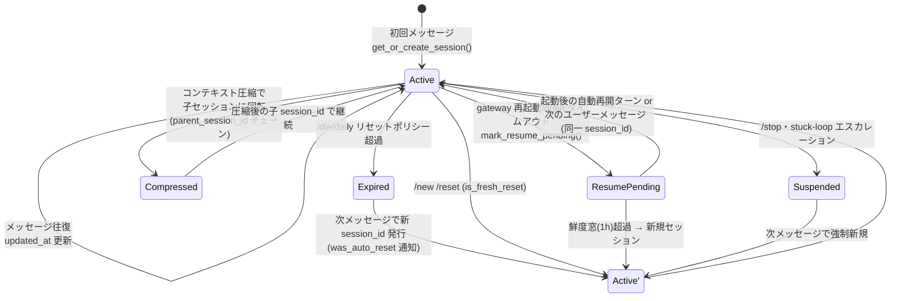

# Hermes Agent のセッションモデリング・ライフサイクル (as-is 調査)

対象リポジトリ: `NousResearch/hermes-agent` (main @ a9b5598909)
調査日: 2026-07-03

パス表記はリポジトリルート相対。行番号は調査時点のもの。
「推測」と明記した箇所以外は、コードを直接確認した事実である。

---

## 0. セッションのライフサイクル全体像

セッションは「チャット上の会話レーン(session_key)」に「トランスクリプト実体(session_id)」を
紐付けたもの。session_key は決定的に導出され不変、session_id はリセット・圧縮のたびに回転する。



エージェントプロセス(gateway)自体のライフサイクル:

```
起動 ──> suspend_recently_active() で直近セッションに resume_pending 付与
     ──> restart_loop_guard 判定 ──> 自動再開ターンを合成
稼働 ──> メッセージごとに asyncio タスク + スレッドプールでエージェント実行
drain ──> .drain_request.json マーカー or SIGTERM ──> 通知 → drain 待ち →
          タイムアウト時 resume_pending 付与 + 割り込み ──> exit 75 (再起動要求)
休止 ──> scale-to-zero: relay-only 構成でアイドル N 分 → go_dormant() →
          Fly の autostop が VM を suspend、wakeUrl への poke で復帰
```

---

## 1. セッションの単位とキー設計

### 1.1 セッションの単位

セッションは「プラットフォーム × チャット × (スレッド) × (ユーザー)」単位。
時間枠はキーには含まれず、リセットポリシー(§1.4)として updated_at に対して評価される。

キー生成の単一の正は `build_session_key()` (gateway/session.py:822-910)。

```python
# gateway/session.py:893-910 (要約)
key_parts = [ns, platform, source.chat_type]   # ns = "agent:main" (§1.2)
if source.chat_id:    key_parts.append(source.chat_id)
if source.thread_id:  key_parts.append(source.thread_id)
isolate_user = group_sessions_per_user          # デフォルト True
if source.thread_id and not thread_sessions_per_user:
    isolate_user = False                        # スレッドは共有がデフォルト
if isolate_user and participant_id:
    key_parts.append(str(participant_id))
return ":".join(key_parts)
```

- DM: `agent:main:<platform>:dm:<chat_id>[:<thread_id>]` (gateway/session.py:858-885)。
  chat_id が無い変則アダプタでは user_id にフォールバックし、複数ユーザーの DM が
  1 セッションに合流する「cross-user history bleed」を防ぐ (session.py:866-882 のコメント)。
- グループ/チャンネル: デフォルトで **参加者ごとに別セッション**
  (`group_sessions_per_user: True`, gateway/config.py:608)。
- スレッド (Discord スレッド、Telegram フォーラムトピック、Slack スレッド):
  デフォルトで **全参加者共有** (`thread_sessions_per_user: False`, gateway/config.py:609)。

### 1.2 キーの名前空間

`agent:main` の `main` は固定リテラルで、マルチプロファイル多重化時のみ
`agent:<profile>` に置き換わる (`_session_key_namespace`, gateway/session.py:802-819)。
プロファイルは `/p/<profile>/` URL prefix やクレデンシャル単位で決まる
(SessionSource.profile, session.py:157)。

### 1.3 新規作成 vs 再利用の判定

`SessionStore.get_or_create_session()` (gateway/session.py:1363-1534) のフロー:

1. session_key で `sessions.json` 由来の in-memory エントリを引く。
2. ヒットした場合、state.db 側で `end_reason` が付いていないか自己修復チェック
   (`_is_session_ended_in_db`, session.py:1267-1291。クラッシュで残った stale ルーティングの吸収, #54878)。
3. `suspended` → 強制新規。`resume_pending` → 鮮度窓(§2.3)内なら同一エントリを返す。
4. リセットポリシー `_should_reset()` (session.py:1293-1339) を評価し、
   期限切れなら旧 session_id を `end_session(…, "session_reset")` して新 session_id を発行。
5. ミスした場合はまず state.db から復旧を試みる
   (`_recover_session_from_db` → `find_latest_gateway_session_for_peer`, session.py:1162-1198)。
   `ended_at IS NULL OR end_reason='agent_close'` の行だけを再オープンする。
6. それでも無ければ新規: `session_id = "%Y%m%d_%H%M%S_" + uuid4().hex[:8]` (session.py:1488)。

session_key / session_id はファイルパスに流れるため、パストラバーサル検査が
入口で行われる (`_is_path_unsafe`, session.py:107-118)。

### 1.4 リセットポリシー

`SessionResetPolicy` (gateway/config.py:276-296): デフォルトは `mode="both"`,
`at_hour=4` (毎日 4 時), `idle_minutes=1440` (24h アイドル)。
アクティブなバックグラウンドプロセスを持つセッションはリセットされない
(session.py:1301-1309)。ただし 24h 以上前のプロセスはリセットをブロックしない
(`bg_process_max_age_hours`, config.py:291-296)。

### 1.5 同一チャンネルの複数ユーザー

- 非スレッドのグループはデフォルトで per-user 分離(上記)。
- 共有セッション(スレッド、または `group_sessions_per_user: False`)では:
  - システムプロンプトに「Multi-user session — messages are prefixed with [sender name]」
    と注記し、ユーザー名は per-turn で固定しない(プロンプトキャッシュを壊さないため。
    gateway/session.py:432-444)。
  - 各ユーザーメッセージの先頭に `[user_name] ` を付ける
    (gateway/run.py:9988-9994, `_prepare_inbound_message_text`)。
  - 判定関数は `is_shared_multi_user_session()` (gateway/session.py:781-799)。

---

## 2. セッションの永続化と再開

### 2.1 二層構造: sessions.json (索引) + state.db (正)

- `~/.hermes/sessions/sessions.json` — **ルーティング索引のみ**。
  session_key → SessionEntry(session_id, updated_at, 各種フラグ) のマップ。
  ファイル先頭に自己文書化の `_README` センチネルを書き込む (gateway/session.py:1083-1093)。
  書き込みは tmp + fsync + atomic_replace (session.py:1094-1108)。
- `~/.hermes/state.db` (SQLite, WAL) — **会話履歴と全セッションの正**
  (hermes_state.py:123 `DEFAULT_DB_PATH`)。CLI/TUI/gateway すべてのセッションが同居。

スキーマ (hermes_state.py:700-777):

```sql
CREATE TABLE sessions (
    id TEXT PRIMARY KEY, source TEXT, user_id TEXT, session_key TEXT,
    chat_id TEXT, chat_type TEXT, thread_id TEXT,
    parent_session_id TEXT,          -- 圧縮分割・ブランチのチェーン
    started_at REAL, ended_at REAL, end_reason TEXT,
    input_tokens ..., estimated_cost_usd ..., title, ...
);
CREATE TABLE messages (
    session_id TEXT, role TEXT, content TEXT,
    tool_call_id, tool_calls, tool_name, reasoning*,
    platform_message_id TEXT,        -- 重複配送 dedupe (#47237)
    observed INTEGER DEFAULT 0,      -- 「観測のみ」のグループ発言 (§5.2)
    active INTEGER DEFAULT 1,        -- /undo のソフト削除
    compacted INTEGER DEFAULT 0
);
CREATE TABLE compression_locks (session_id PRIMARY KEY, holder, expires_at);
```

メッセージ全文検索用の FTS5 テーブルとトリガも持つ (hermes_state.py:802-815)。

### 2.2 ターンごとの永続化と復元

- 各ターン開始時にトランスクリプトを DB からロードして
  エージェントの履歴を再構築する: `history = self.session_store.load_transcript(...)`
  (gateway/run.py:10544 → session.py:1967-1980 → `get_messages_as_conversation`)。
- 書き込みは `append_to_transcript()` (session.py:1891-1924)。エージェント自身が
  `_flush_messages_to_session_db()` で書いた場合は `skip_db=True` で二重書き込みを防ぐ (#860)。
- `AIAgent` インスタンス自体は session_key キーの LRU キャッシュに保持
  (`_agent_cache`: OrderedDict, 上限 128 個・アイドル TTL 1h,
  gateway/run.py:65-67, 2838-2844, `_enforce_agent_cache_cap` 15618)。
  キャッシュヒット時は DB 再読込を省略し、プロセス内のメッセージリストを継続使用する。

### 2.3 プロセス再起動後の再開フロー

1. **drain 前マーキング**: シャットダウン開始時、実行中の全セッションに
   `mark_resume_pending("restart_timeout" | "shutdown_timeout")` を **drain 待ちの前に** 書く
   (gateway/run.py:7830-7846)。drain が正常完了したら markを消す (7859-7872)。
   タイムアウトした残りは再度マークして interrupt (7893-7915)。
2. **クラッシュ対策**: 次回起動時に `suspend_recently_active(max_age_seconds=120)`
   (gateway/session.py:1709-1743) が「直近 120 秒以内に活動があったエントリ」へ
   `resume_pending=True` を付ける。
3. **自動再開**: アダプタ接続後 `_schedule_resume_pending_sessions()`
   (gateway/run.py:6262-6400) が resume_pending なセッションに **空テキストの合成ターン** を
   流し、`_handle_message_with_agent` 内の resume 分岐が「中断からの復帰」システムノートを
   注入して同じ session_id・同じトランスクリプトで続きを実行する。
4. **鮮度ゲート**: 再開が有効なのは `last_resume_marked_at` から 1 時間以内
   (`auto_continue_freshness_window`, gateway/session.py:36-56)。超過したゾンビは
   `resume_pending_expired` として新規セッションに落とす (session.py:1445-1454)。
5. **ループ遮断**: 再開ターン自体が gateway を殺す場合に備え、
   restart_loop_guard (§4.3) が 60 秒に 3 回以上の「再開付き起動」で自動再開をスキップする。

セッションスコープの `/model` オーバーライドも SessionEntry に永続化される
(model/provider/base_url のみ。api_key は絶対に書かない —
`sanitize_model_override`, gateway/session.py:577-599)。

### 2.4 コンテキスト圧縮 (compaction)

**注意(事実)**: `trajectory_compressor.py` は **ライブセッションの compaction ではない**。
学習データ生成 (datagen) 用に、完了済みトラジェクトリの JSONL を後処理でトークン予算
(デフォルト 15,250 tok) に収める CLI である (trajectory_compressor.py:1-31)。
方式は「先頭数ターンと末尾 N ターンを保護し、中間だけを要約 1 メッセージに置換。
要約は OpenRouter 経由の軽量モデル (デフォルト `google/gemini-3-flash-preview`) で生成」
(CompressionConfig, trajectory_compressor.py:82-124)。

ライブセッションの compaction は別実装で、考え方は同じ:

- `agent/context_compressor.py` の `ContextCompressor(ContextEngine)` (622 行目)。
  アルゴリズム: 「(1) 古いツール結果の刈り込み → (2) 先頭保護 → (3) 直近 ~20K tok の
  末尾保護 → (4) 中間を LLM 要約 → (5) 以後は前回要約を反復更新」(docstring, 622-631)。
  セッション境界で per-session 状態 (`_previous_summary` 等) を全消去し、
  別セッションへの要約リークを防ぐ (`on_session_end`, context_compressor.py:659-694)。
- 圧縮でセッションが**分割**されると、新しい子 session_id が発行され
  `sessions.parent_session_id` でチェーンされる。gateway は
  `get_compression_tip()` (hermes_state.py:2612) でチェーン先端まで辿って
  ルーティングを自己修復する (gateway/run.py:10337-10377)。
- 圧縮中の割り込み防止に `compression_locks` テーブルを使い、
  ロック保持中は interrupt を queue に降格する
  (`_session_has_compression_in_flight`, gateway/run.py:4957-4986)。
- さらに gateway 側の「セッション衛生」: ターン開始前にトランスクリプトの推定トークンが
  コンテキスト長の 85% を超えていたら先回りで圧縮する
  (gateway/run.py:10546-10620。エージェント内蔵の圧縮閾値 0.50 より意図的に高い)。

---

## 3. 実行中エージェントへの追加入力 (steering)

実行中判定は `self._running_agents: Dict[session_key, agent]` (gateway/run.py:2790 付近)。
このディクショナリ自体がセッション単位の実行ロックを兼ねる。

新しいメッセージが来たときの分岐 (`_handle_message` の PRIORITY 節,
gateway/run.py:8836-9265):

1. **スラッシュコマンドの特別扱い**: /status /stop /new /queue /steer /approve /background
   などは実行中でも専用ハンドラに直行 (run.py:8896-9157)。その他の認識済みコマンドは
   「⏳ Agent is running…」で丁重に拒否。
2. **busy_input_mode** (デフォルト `"interrupt"`, run.py:2667, `_load_busy_input_mode` 4741):
   - `interrupt`: `running_agent.interrupt(event.text)` — 現在のターンを中断してテキストを渡す
     (run.py:9260-9261)。
   - `queue`: `_queue_or_replace_pending_event()` でターン境界まで保留 (run.py:9222-9225)。
   - `steer`: `running_agent.steer(text)` — **中断せず**、次のツールコール完了直後に
     最後のツール結果へテキストを追記して注入する。role 交替違反なし
     (run.py:9226-9243, /steer コマンドの説明は 9002-9046)。steer 不可なら queue へフォールバック。
3. **interrupt の自動降格**: 実行中エージェントがサブエージェント
   (`delegate_task`) を駆動中 (run.py:9244-9259, #30170)、または圧縮ロック保持中は、
   interrupt モードでも queue に降格して進行中の作業を守る。
4. **バーストの吸収**: 写真のみのフォローアップ (run.py:9159-9164) と、
   Telegram でターン開始から 3 秒以内のテキスト (9166-9193) は割り込まずマージ・キューイング。

キューの実装は 2 段構え:

- `adapter._pending_messages[session_key]` — セッションごと **1 スロット**。
  複数メッセージはテキストマージされる (`merge_pending_message_event`)。
- `/queue` 明示コマンド用のオーバーフローリスト `_queued_events`
  (run.py:2804-2813)。FIFO で 1 件ずつ独立ターンとして処理、上限 32 件
  (`_BUSY_QUEUE_MAX_PENDING`, run.py:4988 付近)。

ターン終了後、`_dequeue_pending_event()` (run.py:2047-2054) で保留イベントを取り出し、
音声なら文字起こしを済ませてから **再帰的に次のターンとして実行** する (run.py:18734-18800)。
つまり「実行中の追加入力は、割り込み or ツール間注入 or ターン境界キュー」の 3 択で、
無視されることはない(drain 中の interrupt モードのみ落ちる。run.py:9214-9221)。

---

## 4. スケールとライフサイクル

### 4.1 scale-to-zero (gateway/scale_to_zero.py)

前提: このリポジトリの scale-to-zero は Cloud Run ではなく **Fly.io の
autostop:"suspend" / autostart** を前提にした「relay 経由構成」専用の実装。

- **有効化条件** (`should_arm`, scale_to_zero.py:91-104): 3 条件の AND。
  1. env `HERMES_SCALE_TO_ZERO` が truthy (Labs トグル、scale_to_zero.py:36)
  2. メッセージングが **relay-only か無し** (`messaging_is_relay_only_or_absent`, 72-83)。
     Discord/Telegram 等の直結ソケットが 1 つでもあれば無効 — 常駐接続はゼロスケール不可能。
  3. wakeUrl が登録済み (「起こす手段のない suspend はブラックホール」)
- **アイドル判定** (`is_idle`, scale_to_zero.py:107-124): 純関数で
  「実行中ターン 0 かつ 最終 inbound から N 分 (デフォルト 5 分, 39 行目) かつ
  バックグラウンド作業なし」。バックグラウンド作業には delegate_task / kanban /
  background terminal / pending watcher を数える
  (`_scale_to_zero_has_live_background_work`, gateway/run.py:3960-3986)。
  内部イベント(完了通知等)は inbound クロックを進めない (run.py:8574-8580)。
- **休止シーケンス** (`_scale_to_zero_watcher`, gateway/run.py:4142-4198):
  30 秒間隔でアイドルを監視 → runtime status を `draining` に → relay adapter の
  `go_dormant()` (ソケットだけ閉じ、再接続スーパーバイザは保持) →
  **プロセスは生かしたまま** トラフィックが消えた VM を Fly が suspend。
  復帰は connector が wakeUrl を poke → autostart → 保持していたスーパーバイザが
  再ダイヤル → connector 側の耐久バッファに溜まったメッセージを drain。
  suspend は RAM を保持するので `mark_resume_pending` は**意図的に呼ばない** (D13)。
  復帰直後の再休止を防ぐ cooldown (interval と 60 秒の大きい方) あり。

### 4.2 drain 制御 (gateway/drain_control.py)

稼働中の gateway への外部制御チャネル (HTTP 等) は**存在しない**。ダッシュボードは
`~/.hermes/.drain_request.json` マーカーを書き、gateway 内の watcher
(`_drain_control_watcher`, run.py:4422, 1 秒間隔) がそれを読んで `draining` 状態に入る
(drain_control.py:1-49)。ポイント:

- マーカーには「インスタンス化 epoch」(kernel boot_id + PID1 の starttime,
  `current_instantiation_epoch`, drain_control.py:67-126) をスタンプする。
  HERMES_HOME が永続ボリュームだと、マシン再起動後も古い begin-drain マーカーが残り
  新しい gateway が永遠に draining で固まる事故 (NS-570) があったため、
  epoch 不一致のマーカーは無視する。
- 壊れた/中身のないマーカーは「drain 有効」として扱う (quiesce 側に fail-safe)。

### 4.3 restart 系

- `gateway/restart.py`: exit code の規約。**75 (EX_TEMPFAIL) = graceful drain 完了後に
  サービスマネージャへ再起動を依頼**、78 (EX_CONFIG) = 恒久的な設定エラーで
  s6 が respawn を止める (restart.py:5-13)。
- `gateway/restart_loop_guard.py`: 自動再開 → SIGTERM → respawn → 自動再開…の
  無限ループを断つ最終回路ブレーカ。`~/.hermes/gateway/restart_loop.json` に
  起動タイムスタンプのローリングウィンドウを永続化し、60 秒に 3 回以上
  「再開待ちセッション付き起動」があれば **その起動では自動再開をスキップ**
  (restart_loop_guard.py:1-45, 122-150)。壊れたら fail-open。
- `gateway/shutdown_forensics.py`: SIGTERM/SIGINT 受信時に <10ms で
  「誰が殺したか」(si_pid の /proc cmdline 等) をスナップショットし、
  重い `ps` ウォークは detach したサブプロセスに逃がす (shutdown_forensics.py:1-16)。
  「gateway が死に続ける」障害の事後解析用。

### 4.4 シャットダウン drain の手順 (gateway/run.py:7810-7930)

1. `_running=False; _draining=True`、アダプタ接続が生きているうちに
   アクティブセッションへ「シャットダウンします」通知。
2. `restart_drain_timeout` (config) だけ実行中ターンの完了を待つ。
3. **待つ前に** resume_pending を先行マーキング (drain 中に SIGKILL されても復元可能に)。
4. タイムアウトしたら interrupt → 5 秒待ち → ツールのサブプロセスを kill
   (systemd の SIGKILL エスカレーションに先回り, #8202)。

---

## 5. 起動トリガと間引き

### 5.1 認可が最初のゲート

メッセージ処理パイプライン (`_handle_message`, gateway/run.py:8530-8675) は
まず認可を通す。未認可ユーザーは DM ではペアリングコード発行
(`hermes pairing approve …`)、グループでは沈黙 (run.py:8635-8675)。
その前に `pre_gateway_dispatch` プラグインフックが走り、skip / rewrite / allow を返せる
(run.py:8582-8621)。

### 5.2 グループでのメンションゲート (アダプタ層)

起動条件はプラットフォームアダプタごとの設定で、gateway コアには存在しない:

- DM: 常に全メッセージに反応。
- Telegram (plugins/platforms/telegram/adapter.py):
  - `require_mention` (デフォルト **false** = グループでも全メッセージ反応。
    adapter.py:6210-6217, env `TELEGRAM_REQUIRE_MENTION`)
  - グループ許可リスト `group_allowed_chats` (6263 付近)
  - `observe_unmentioned_group_messages`: メンションされなかったグループ発言を
    **エージェントは起動せずトランスクリプトに `observed=1` で記録**し、
    後で @メンションされたときの文脈として見せる (6219-6234,
    messages.observed カラム, run.py:756-768 の replay 除外処理)。
- Discord (plugins/platforms/discord/adapter.py):
  - メンション必須が基本で、`free_response_channels` に列挙したチャンネルだけ
    メンションなしで反応 (4631, 5760, 5818)。
  - bot 発メッセージの扱い `allow_bots: "mentions"` 等 (1056-1071)、
    他 bot がメンションされていて自分がされていなければ沈黙 (1099-1123)。
- relay 構成では、この「mention-gating / free-response / allow-bots」ポリシーを
  connector 側に宣言して **配送前に** 同じゲートを効かせる
  (`send_relay_policy`, gateway/relay/__init__.py:612-661, gateway/run.py:6668-6672)。

### 5.3 応答側の間引き (response_filters.py)

軽量 LLM による事前の「反応すべきか」分類器は**存在しない**(事実)。代わりに:

- 判断をメインエージェント自身に委ね、応答が正確に `NO_REPLY` / `[SILENT]` 等の
  マーカーだけだった場合に配送を抑止する
  (`LIVE_GATEWAY_SILENT_MARKERS`, gateway/response_filters.py:13-53)。
  マーカーは 64 文字以下・完全一致のみで、本文中に言及されただけなら普通に配送。
- ストリーミング中は「まだ NO_REPLY に化けうるプレフィックス」を画面に出さず保留する
  (`is_partial_silence_marker`, response_filters.py:56-80)。
- cron でも同じ `[SILENT]` パターンで「変化があったときだけ通知」を実現
  (cron/scheduler.py:257 `_is_cron_silence_response`)。

(推測) 「観測モード + require_mention + NO_REPLY」の組み合わせが、
ヒューリスティック分類器の代替として設計されている。

---

## 6. 実行環境の隔離と成果物

### 6.1 プロセスモデルと Docker

- gateway は **単一プロセス・単一コンテナ**で全セッションを共有する。
  セッション/エージェント単位のコンテナ隔離は無い(事実)。
- docker-compose.yml: s6-overlay を PID1 とする 1 サービス構成。
  `~/.hermes` をコンテナの `/opt/data` にマウントし、HERMES_UID/GID で
  ホスト所有権に合わせる (docker-compose.yml:30-41)。`network_mode: host`。
- ツール実行環境は差し替え可能: tools/environments/ に
  local / docker / ssh / modal / daytona / singularity の各 Environment 実装があり、
  terminal 系ツールの実行先を設定で選べる。デフォルトは LocalEnvironment
  (tools/environments/local.py:893)。つまり隔離は「セッション単位」ではなく
  「ツール実行の設定単位」。

### 6.2 成果物の保存と共有

- エージェント状態・成果物はすべて `HERMES_HOME` (通常 `~/.hermes`) 配下。
  cron 出力は `~/.hermes/cron/output/` (システムプロンプトにも明示。
  gateway/session.py:561-563)。
- エージェント応答に含まれるファイルパスは `adapter.extract_media()` で抽出され、
  配送許可パスのフィルタを通ってチャットに添付送信される (gateway/run.py:12849-12860)。
- 配送ルーティングは gateway/delivery.py: `"origin"` (発生元チャット) /
  `"<platform>"` (ホームチャンネル) / `"platform:chat_id"` (明示) / `"local"` (ファイルのみ)
  (delivery.py:1-9, session.py:544-572 のプロンプト注入)。

### 6.3 cron / routines

- cron/scheduler.py: ThreadPoolExecutor ベースのジョブランナー。ジョブごとに
  toolset 制限、スクリプト前処理 (stdout をコンテキスト注入)、スキルチェーン、
  配送先指定を持つ。ジョブは contextvars で自分の配送先を持ち並行実行しても混線しない
  (gateway/session_context.py:112-114 の CRON_AUTO_DELIVER 変数)。
- hermes-already-has-routines.md は機能のマーケティング文書で、
  トリガは 3 種: (1) `hermes cron create "<cron式>" "<プロンプト>" --deliver telegram`、
  (2) GitHub 等の webhook 購読 (`hermes webhook subscribe --events pull_request --prompt …`)、
  (3) HMAC 認証付き汎用 API トリガ。`[SILENT]` で無変化時の通知抑制。

---

## 7. マルチエージェント / 複数会話の並行実行

- **並行性モデルは asyncio タスク + 共有スレッドプール**。プロセス分離ではない。
  1. アダプタがメッセージごとに `asyncio.create_task(self._process_message_background(...))`
     を張り、セッションごとの guard (`_active_sessions[session_key]`) を置く
     (gateway/platforms/base.py:4408-4437)。
  2. gateway 側は `_running_agents[session_key]` が同一会話の直列化ロックを担う
     (実行中なら §3 の interrupt/queue/steer 分岐へ)。
  3. ブロッキングな `agent.run_conversation()` 本体は gateway 専有の
     ThreadPoolExecutor (**max_workers=10**) で実行
     (`_get_executor`, gateway/run.py:14341-14355)。
     contextvars を `copy_context()` で持ち込む
     (`_run_in_executor_with_context`, run.py:14330-14339)。
- セッション識別 (platform / chat_id / session_id …) は `os.environ` ではなく
  **contextvars** に載せ、並行ターン間の取り違えを構造的に防ぐ
  (gateway/session_context.py:1-37)。さらに `create_task` の context 継承による
  「兄弟セッションの ID を子プロセスが読む」リークを、ハンドラ先頭の
  `reset_session_vars()` で潰す (session_context.py:245-284, run.py:8545-8560)。
- 同時アクティブセッション数の上限はオプション (`max_concurrent_sessions`,
  `_active_session_limit_message`, gateway/run.py:4875-4889。クロスプロセスの
  スロット取得は hermes_cli.active_sessions)。
- 1 会話の中の並行性は `delegate_task` (サブエージェント) と background terminal が担い、
  これらの生存が scale-to-zero とセッションリセットの両方をブロックする (§4.1, §1.4)。

---

## 8. 設計の学び / Cloud Run 転用ポイント

Cloud Run (min-instances=0, イベント起動, アイドル停止) で Slack ボットを作る前提での評価。

### 真似すべき点

1. **session_key (会話レーン) と session_id (トランスクリプト) の分離**。
   キーは決定的・不変、実体はリセット/圧縮で回転し `parent_session_id` でチェーンする。
   「/new は新 id、圧縮も新 id、ルーティングは常にチェーン先端へ自己修復」という
   モデル (gateway/run.py:10337-10377) は、ステートレスなコンテナ再起動と非常に相性が良い。
2. **「ルーティング索引」と「履歴の正」を分ける二層永続化**。索引 (sessions.json 相当) は
   壊れても DB から `find_latest_gateway_session_for_peer` で再構築できる (§2.1, §1.3-5)。
   Cloud Run なら索引もろとも Firestore/CloudSQL に置けばよいが、
   「索引は落ちても復元可能」という設計原則自体が重要。
3. **毎ターン DB から履歴を再構築する前提**にし、プロセス内キャッシュ (agent cache) は
   純粋な最適化に留める。Hermes はキャッシュミスでも同じ結果になるよう作られており、
   これがそのまま「どのインスタンスに当たっても続きが動く」性質になる。
4. **resume_pending の先行マーキング** (§2.3)。drain 待ちの「前」に耐久フラグを書き、
   完走したら消す。SIGKILL に対する備えとして Cloud Run の 10 秒 SIGTERM 猶予でも同じ
   手順が有効。鮮度窓 (1h) でゾンビ再開を防ぐのも忘れずに。
5. **restart_loop_guard の思想**: 「自動再開が自分を殺す」ループは永続ストアの
   ローリングウィンドウでしか検出できない。Cloud Run でもクラッシュループ時に
   自動リプレイを止める回路ブレーカを最初から入れるべき。
6. **アイドル判定の 3 条件 AND** (実行中ターン 0 / inbound 無し / バックグラウンド作業無し)
   を純関数に切り出している点 (scale_to_zero.py:107-124)。Cloud Run では
   「リクエスト完了 = 課金停止・CPU スロットリング」なので、バックグラウンド作業を
   「リクエストの寿命に閉じ込める」か「Cloud Tasks 等へ外出しする」設計判断がここに対応する。
7. **NO_REPLY マーカー + observed 記録** (§5.2-5.3)。グループでの間引きを
   「配送前ゲート (メンション) + 配送後ゲート (沈黙マーカー) + 観測ログ」の 3 点で構成する
   パターンは Slack ボットにそのまま移植できる。
8. **busy 時の 3 モード (interrupt / queue / steer) と自動降格**。少なくとも
   「実行中に来たメッセージをキューし、ターン終了後に次ターンとして drain」する
   仕組み (§3) は必須。steer (ツールコール間注入) は UX 差別化として優秀。
9. **relay/connector に「常駐接続と耐久バッファ」を外出しする構造** (§4.1)。
   Slack は Events API (HTTP push) なら常駐接続が不要なので、Cloud Run 自体が
   connector 役を果たせる。Socket Mode を使うなら Hermes と同様に
   「常駐する小さな relay + ゼロスケールする本体」に分けるのが正解。

### 避けるべき点 / そのまま持ち込めない点

1. **単一プロセス内のミュータブル状態の多さ**。`_running_agents` / `_pending_messages` /
   `_agent_cache` / `_session_model_overrides` などはすべてプロセスローカルで、
   複数インスタンスには水平分割できない。Cloud Run で max-instances>1 にするなら、
   実行ロックとキューは最初から外部 (例: Firestore トランザクション、Cloud Tasks,
   Redis) に置く必要がある。Hermes は「1 ユーザー 1 常駐プロセス」前提の設計。
2. **ローカルファイル markers (.drain_request.json, restart_loop.json) による制御**は
   永続ボリューム前提。Cloud Run にボリュームはない(あっても GCS FUSE)ので、
   同等の制御は管理 API + DB フラグで実装する。ただし NS-570 の教訓
   —「耐久ストアに書いた lifecycle フラグはインスタンス世代 (epoch) でスタンプし、
   世代違いは無視する」— はどんな基盤でも適用価値がある。
3. **suspend 前提 (RAM 保持) の scale-to-zero はそのまま使えない**。Fly の suspend と違い
   Cloud Run の scale-to-zero はプロセス消滅なので、Hermes が「suspend だから
   resume_pending を書かない」(D13) としている箇所は、Cloud Run では逆に
   **毎リクエスト終了時に再開可能な状態を書き切る**必要がある。
4. **exit code 75 による self-restart 規約**は s6/systemd/launchd 前提。
   Cloud Run はリビジョン置換とヘルスチェックで代替する。
5. **20,000 行の run.py**。メッセージパイプライン・スラッシュコマンド・drain・
   scale-to-zero・プラットフォーム特例 (Telegram topic 等) が一枚に同居しており、
   追跡コストが高い。新規実装ではハンドラ/ライフサイクル/配送を最初からモジュール分割
   したほうがよい (Hermes 自身も session/config/drain_control 等の切り出しを進めている)。
6. **グループのデフォルト per-user セッション分離** (`group_sessions_per_user: True`) は
   Slack チャンネルの体験としては不自然になりがち (同じチャンネルで人ごとに文脈が違う)。
   Slack ならスレッド共有 (thread_sessions_per_user=False 相当) +
   チャンネル単位共有をデフォルトにし、per-user はオプトインが妥当。
   Hermes もスレッドは共有をデフォルトにしている点は参考になる。

---

## 付録: 主要ファイル早見表

| ファイル | 役割 |
|---|---|
| gateway/session.py | session_key 生成、SessionStore、リセットポリシー評価、resume フラグ |
| gateway/session_context.py | contextvars ベースのセッション束縛 (並行安全) |
| hermes_state.py | SessionDB (state.db)。sessions/messages スキーマ、圧縮チェーン、FTS |
| gateway/run.py | GatewayRunner。メッセージパイプライン、busy 分岐、agent cache、drain、watcher 群 |
| gateway/platforms/base.py | アダプタ基底。メッセージごとの asyncio タスク化、pending スロット |
| gateway/scale_to_zero.py | アイドル判定の純関数群 (Fly suspend 前提) |
| gateway/drain_control.py | ファイルマーカーによる外部 drain 制御 + instantiation epoch |
| gateway/restart.py / restart_loop_guard.py | exit code 規約 / 自動再開ループ遮断 |
| gateway/shutdown_forensics.py | SIGTERM 犯人追跡スナップショット |
| gateway/response_filters.py | NO_REPLY / [SILENT] 応答抑止 |
| agent/context_compressor.py | ライブ compaction (要約ベース) |
| trajectory_compressor.py | 学習データ用のオフライン圧縮 CLI (ライブ用ではない) |
| cron/scheduler.py, gateway/delivery.py | 定期実行 (routines) と成果物配送 |
